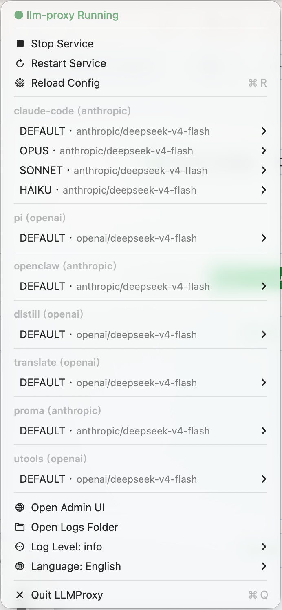
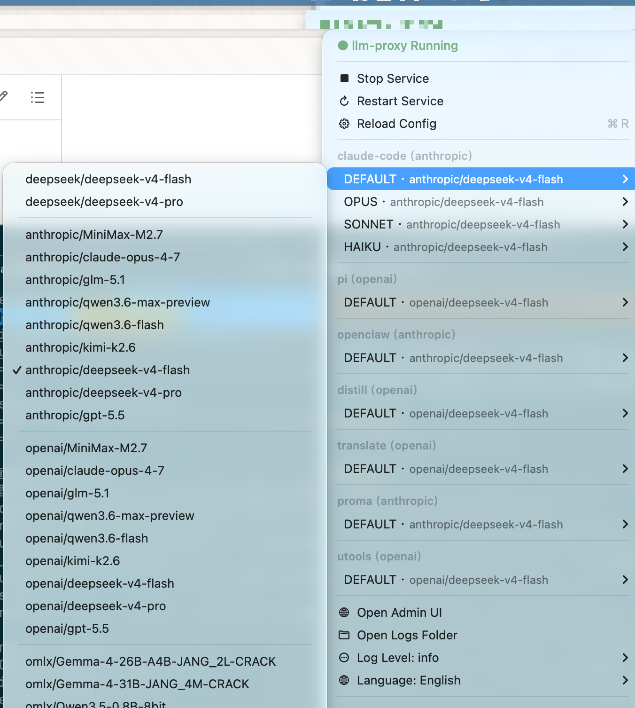
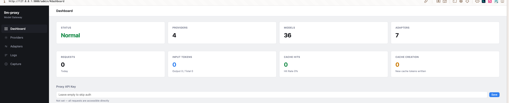
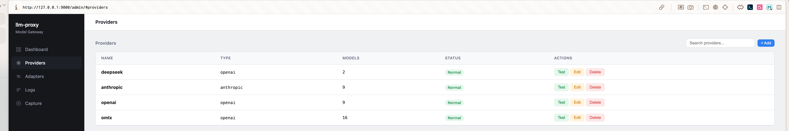
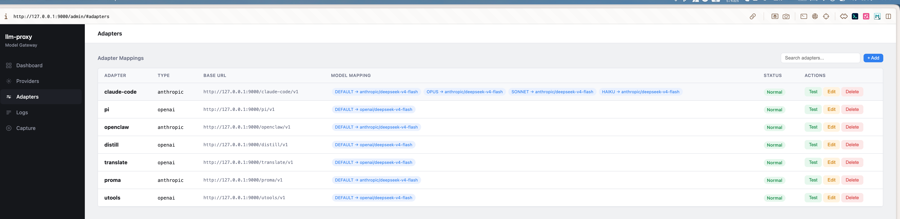

# llm-proxy

[English](./README.md) | [简体中文](./README.zh.md)

A local LLM proxy server — single port serving both admin UI and AI API, with multi-protocol routing, protocol translation, streaming SSE conversion, token tracking, and protocol capture debugging.

## Features

- 🔀 **Multi-Protocol**: Anthropic, OpenAI, and OpenAI Responses on a single port
- 🔄 **Protocol Translation**: Bidirectional conversion across all three protocols (streaming + non-streaming)
- 📸 **External Vision**: Image-to-text fallback for non-multimodal models — auto-converts images via a configured vision model, with persistent LRU cache
- 🖥️ **macOS App**: Native menu bar app with built-in proxy — zero dependencies, drag & drop install
- 📊 **Admin UI**: Alpine.js SPA with dashboard, provider management, adapter config, vision settings, and capture debugger
- 🎯 **Virtual Adapters**: Custom endpoints with model remapping (`/{adapter-name}/v1/...`)
- 📡 **SSE Streaming**: 4 bidirectional stream converters with per-line timestamps
- 🔍 **Protocol Capture**: Ring buffer recording raw request/response pairs with side-by-side diff
- 🔥 **Hot Reload**: Atomic config swap without dropping in-flight requests
- 📈 **Token Tracking**: Per-provider token usage statistics

## Screenshots

<p align="center">
  &nbsp;&nbsp;
  
</p>

<p align="center"><em>macOS menu bar — service control, adapter switching, language settings &nbsp;|&nbsp; adapter list &amp; model mapping</em></p>

<br>



<p align="center"><em>Admin dashboard — provider status, token usage, proxy key management</em></p>

<br>



<p align="center"><em>Provider management — add/edit/delete AI providers, pull model lists, set input modalities</em></p>

<br>



<p align="center"><em>Adapter configuration — virtual endpoints with model remapping</em></p>

## Install

**macOS (recommended):**
Download `LLMProxy.dmg` from [Releases](https://github.com/maplezzk/llm-proxy/releases), drag to `/Applications`. If macOS blocks the app, run:
```bash
xattr -cr /Applications/LLMProxy.app
```
Then open again. Includes everything — CLI, proxy, and admin UI.

**macOS (Homebrew):**
```bash
brew tap maplezzk/tap && brew install --cask llm-proxy
```

**CLI only:**
```bash
npm install -g @maplezzk/llm-proxy
```

## Quick Start

```bash
# Start proxy
llm-proxy start

# Open admin UI → http://127.0.0.1:9000/admin/
```

On first launch, the config directory is created automatically. Open the admin UI to configure everything in your browser — no manual YAML editing needed.

The admin UI supports:
- **Provider management**: Add/edit/delete AI providers, pull model lists from APIs, declare input modalities (text/image)
- **Adapter config**: Create virtual endpoints with model remapping and protocol adaptation
- **Vision settings**: Enable external vision (image-to-text) for non-multimodal models, view cache stats
- **Proxy key**: Set API authentication key
- **Live test**: Send test requests directly to verify configuration
- **Protocol capture**: Real-time request/response inspection

## Configuration

`~/.llm-proxy/config.yaml`:

```yaml
log_level: debug          # debug | info | warn | error
port: 9000                # Optional: default 9000
max_body_size: 10485760   # Optional: max request body in bytes (default 10MB)
proxy_key: sk-xxx         # Optional: if set, /v1/* requires auth

providers:
  - name: deepseek
    type: openai          # anthropic | openai | openai-responses
    api_key: ${DEEPSEEK_API_KEY}
    api_base: https://api.deepseek.com
    models:
      - id: deepseek-chat

  - name: anthropic
    type: anthropic
    api_key: ${ANTHROPIC_API_KEY}
    models:
      # Multimodal model — declare image input modality
      - id: claude-sonnet-4
        input: [text, image]
        thinking:
          budget_tokens: 10000

      # Non-multimodal model — images will be auto-converted via vision provider
      - id: deepseek-reasoner
        # input omitted → defaults to [text]; image requests trigger vision fallback

      # MiniMax adaptive thinking passthrough (non-standard thinking.type)
      - id: MiniMax-M2
        thinking:
          type: enabled

adapters:
  - name: my-tool
    type: anthropic
    models:
      - sourceModelId: claude-sonnet-4
        provider: anthropic
        targetModelId: claude-sonnet-4-20250514

# External Vision — image-to-text for non-multimodal models
vision:
  provider: anthropic              # Required: vision-capable provider
  model: claude-sonnet-4           # Required: multimodal model ID
  prompt: |                        # Optional: custom prompt (default shown below)
    请详细描述这张图片的内容，包括其中的文字、物体、场景、颜色等关键信息。
```

API keys use environment variable interpolation (`${VAR}`) — never stored in plain text.

## External Vision

When the routed model **does not** declare `input: image`, llm-proxy can automatically convert image content to text using a configured vision model:

1. Inbound request contains an image block (Anthropic `image`, OpenAI Chat `image_url`, or OpenAI Responses `input_image`)
2. llm-proxy extracts each image and calls the configured vision provider/model via the proxy itself (recursive routing)
3. The image is replaced with a `<image_description>...</image_description>` text block
4. The non-multimodal model receives text and "sees" the image content

**Vision cache** (`~/.llm-proxy/vision-cache.json`):
- Keys: `md5:<hash>` for base64 images, `url:<original>` for URLs
- LRU eviction at 1000 entries (configurable via `vision_cache.max_entries`)
- 5s debounced flush to disk; sync flush on process exit
- Stats: hits / misses / hit-rate exposed at `/admin/vision-cache/stats`

Cache storage location: `~/.llm-proxy/vision-cache.json`

## CLI

```bash
llm-proxy start     # Start proxy server
llm-proxy stop      # Stop proxy server
llm-proxy restart   # Restart
llm-proxy reload    # Hot-reload config
llm-proxy status    # Show status
```

## Admin API

| Endpoint | Method | Description |
|----------|--------|-------------|
| `/admin/config` | GET | Current config (keys redacted) |
| `/admin/config/reload` | POST | Hot-reload config |
| `/admin/health` | GET | Health check |
| `/admin/status/providers` | GET | Provider stats |
| `/admin/logs` | GET | Request logs |
| `/admin/logs/stats` | GET | Log statistics |
| `/admin/token-stats` | GET | Token usage stats |
| `/admin/log-level` | GET / PUT | Read / update log level |
| `/admin/locale` | GET / PUT | Read / update UI locale (zh / en) |
| `/admin/port` | GET / PUT | Read / update listening port (requires restart) |
| `/admin/proxy-key` | GET / PUT | Read / update proxy auth key |
| `/admin/vision` | GET / PUT | Read / update external-vision config |
| `/admin/vision-cache/stats` | GET | Vision cache hit / miss / size |
| `/admin/vision-cache/clear` | POST | Clear vision cache |
| `/admin/adapters` | GET / POST / PUT / DELETE | Adapter CRUD |
| `/admin/providers` | POST / PUT / DELETE | Provider CRUD |
| `/admin/providers/:name/pull-models` | POST | Pull remote model list |
| `/admin/test-model` | POST | Send a test request to a provider/model |
| `/admin/test-adapter` | POST | Send a test request through an adapter |
| `/admin/debug/captures/*` | GET / POST | Protocol capture ring buffer + SSE stream |

## Protocol Translation Matrix

| Source | Target | Non-streaming | Streaming (SSE) |
|--------|--------|:---:|:---:|
| Anthropic | OpenAI | ✅ | ✅ |
| OpenAI | Anthropic | ✅ | ✅ |
| Anthropic | OpenAI Responses | ✅ | ✅ |
| OpenAI Responses | Anthropic | ✅ | ✅ |

## Architecture

```
Client → POST /v1/{messages|chat/completions|responses}
  → server.ts (regex route match)
    → pipeline.ts (unified request pipeline)
      → parseAndAuth() (body, JSON, auth, model extraction)
      → vision.ts (image → text fallback for non-multimodal models, with cache)
      → router.ts (modelName → Provider)
      → translation.ts (protocol conversion, thinking injection)
      → provider.ts (fetch upstream)
      → stream-converter.ts (SSE transform)
      → capture.ts (ring buffer + SSE push)
      → token-tracker (per-provider usage stats)
  → Response
```

- **Runtime**: Node.js >= 20, TypeScript ESM
- **Frontend**: Alpine.js SPA (admin UI)
- **Build**: `tsc` + `esbuild` (admin-app.js)
- **Testing**: Node.js native test runner + tsx (280 tests)

## Development

See [DEVELOPMENT.md](./DEVELOPMENT.md) for full development workflow.

```bash
# CLI
npm run dev          # Start proxy in dev mode
npm test             # Run 280 tests

# macOS app
npm run build:app    # Build .app + .dmg
```

## FAQ

**Homebrew shows old version?** Refresh tap:
```bash
brew upgrade --cask llm-proxy
```
If that fails, uninstall first and reinstall:
```bash
brew uninstall --cask llm-proxy
brew untap maplezzk/tap && brew tap maplezzk/tap && brew install --cask llm-proxy
```

**macOS blocks the app?** Remove quarantine:
```bash
xattr -cr /Applications/LLMProxy.app
```

**How do I clear the vision cache?** Either delete the cache file:
```bash
rm ~/.llm-proxy/vision-cache.json
```
or call `POST /admin/vision-cache/clear` (or use the **Clear** button in the Admin UI → Vision settings).

**Where is vision cache stored?** `~/.llm-proxy/vision-cache.json` — survives restarts and is debounced-flushed every 5s.

**How do I enable image input for a model?** In Admin UI → Providers → edit a model → check **图片 (Image)** under **输入模态 (Input modalities)**, or in `config.yaml` add `input: [text, image]`. Models without image declared will trigger vision fallback if `vision:` is configured.