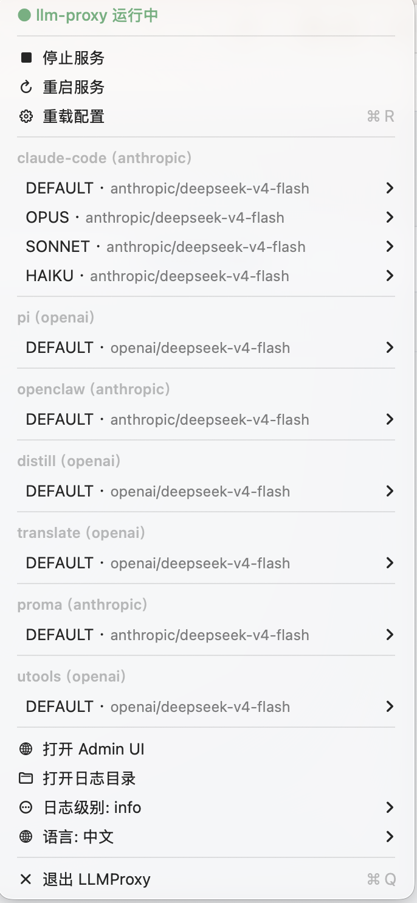
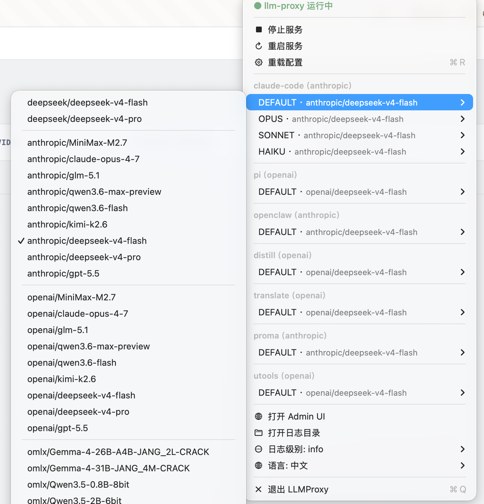
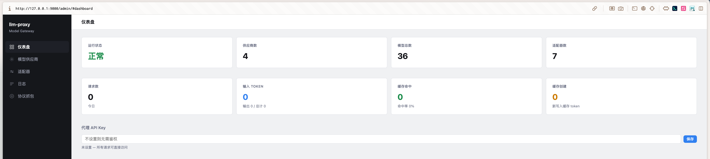
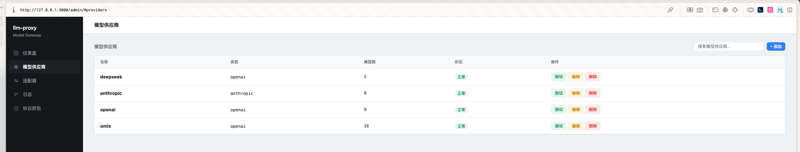
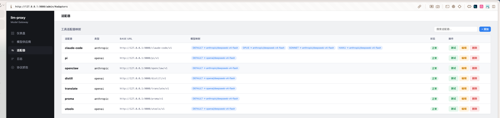

# llm-proxy

[English](./README.md) | [简体中文](./README.zh.md)

本地 LLM 代理服务，单端口同时提供管理 UI 和 AI API，支持多协议路由、协议互转、流式 SSE 转换、token 统计、协议抓包调试。

## 功能特性

- 🔀 **多协议支持**：单端口提供 Anthropic、OpenAI、OpenAI Responses 三种协议
- 🔄 **协议互转**：三个协议间双向转换（流式 + 非流式）
- 📸 **外挂识图**：为不支持图片的模型自动接入识图模型，把图片转成文字描述再转发；自带持久化 LRU 缓存
- 🖥️ **macOS 桌面应用**：原生菜单栏 App，内嵌代理服务，拖拽安装、零依赖
- 📊 **管理界面**：Alpine.js 单页应用，包含仪表盘、Provider 管理、适配器配置、识图设置、抓包调试
- 🎯 **虚拟适配器**：自定义端点 + 模型重映射（`/{adapter-name}/v1/...`）
- 📡 **SSE 流式**：4 个双向流转换器，每行带时间戳
- 🔍 **协议抓包**：环形缓冲记录原始请求/响应，支持左右对比 + 差异分析
- 🔥 **热加载**：配置原子替换，进行中请求不受影响
- 📈 **Token 统计**：按 Provider 统计 token 使用量

## 截图

<p align="center">
  &nbsp;&nbsp;
  
</p>

<p align="center"><em>macOS 菜单栏 — 服务控制、适配器切换、语言设置 &nbsp;|&nbsp; 适配器列表和模型映射</em></p>

<br>



<p align="center"><em>管理仪表盘 — Provider 状态、Token 用量、代理密钥管理</em></p>

<br>



<p align="center"><em>Provider 管理 — 添加/编辑/删除 AI 服务商，拉取模型列表，声明输入模态</em></p>

<br>



<p align="center"><em>适配器配置 — 虚拟端点 + 模型重映射</em></p>

## 安装

**macOS（推荐）：**
从 [Releases](https://github.com/maplezzk/llm-proxy/releases) 下载 `LLMProxy.dmg`，拖入 `/Applications`。如果 macOS 阻止运行，执行：
```bash
xattr -cr /Applications/LLMProxy.app
```
再次打开即可。内含完整代理服务和管理界面。

**macOS（Homebrew）：**
```bash
brew tap maplezzk/tap && brew install --cask llm-proxy
```

**仅 CLI：**
```bash
npm install -g @maplezzk/llm-proxy
```

## 快速开始

```bash
# 启动
llm-proxy start

# 打开管理界面 → http://127.0.0.1:9000/admin/
```

首次启动会自动创建配置目录。打开管理界面在浏览器里完成所有配置，无需手写 YAML。

管理界面支持：
- **Provider 管理**：增删改 AI 服务商、拉取远程模型列表、声明输入模态（文本/图片）
- **适配器配置**：创建带模型重映射和协议转换的虚拟端点
- **识图设置**：为不支持图片的模型启用外挂识图、查看缓存命中率
- **代理密钥**：设置 API 认证密钥
- **连通性测试**：直接发送测试请求验证配置
- **协议抓包**：实时查看请求/响应原文

## 配置

`~/.llm-proxy/config.yaml`:

```yaml
log_level: debug          # debug | info | warn | error
port: 9000                # 可选：默认 9000
max_body_size: 10485760   # 可选：请求体大小上限（字节，默认 10MB）
proxy_key: sk-xxx         # 可选：设置后 /v1/* 需认证

providers:
  - name: deepseek
    type: openai          # anthropic | openai | openai-responses
    api_key: ${DEEPSEEK_API_KEY}
    api_base: https://api.deepseek.com
    models:
      - id: deepseek-chat

  - name: anthropic
    type: anthropic
    api_key: ${ANTHROPIC_API_KEY}
    models:
      # 多模态模型 — 显式声明支持图片
      - id: claude-sonnet-4
        input: [text, image]
        thinking:
          budget_tokens: 10000

      # 非多模态模型 — 图片请求会自动走外挂识图
      - id: deepseek-reasoner
        # 不写 input → 默认 [text]；图片请求触发外挂识图

      # MiniMax 思考模式透传（非标准 thinking.type）
      - id: MiniMax-M2
        thinking:
          type: enabled

adapters:
  - name: my-tool
    type: anthropic
    models:
      - sourceModelId: claude-sonnet-4
        provider: anthropic
        targetModelId: claude-sonnet-4-20250514

# 外挂识图 — 为不支持图片的模型自动识图
vision:
  provider: anthropic              # 必填：识图 Provider
  model: claude-sonnet-4           # 必填：多模态模型 ID
  prompt: |                        # 可选：自定义提示词（默认见下）
    请详细描述这张图片的内容，包括其中的文字、物体、场景、颜色等关键信息。
```

API Key 通过环境变量注入（`${VAR}`），配置文件不保存明文密钥。

## 外挂识图

当路由目标模型 **未声明** `input: image` 时，llm-proxy 可以自动把图片内容转成文字描述，再交给模型处理：

1. 入站请求包含图片块（Anthropic `image`、OpenAI Chat `image_url`、OpenAI Responses `input_image`）
2. llm-proxy 提取每张图片，通过代理自身路由调用配置的识图 Provider/Model（递归路由）
3. 把图片块替换为 `<image_description>...</image_description>` 文本块
4. 非多模态模型收到文本，就能"看懂"图片内容

**识图缓存**（`~/.llm-proxy/vision-cache.json`）：
- 键：base64 图片用 `md5:<hash>`，URL 图片用 `url:<原 URL>`
- LRU 淘汰上限 1000 条（可通过 `vision_cache.max_entries` 调整）
- 内存变更后 5s 防抖刷盘；进程退出前同步刷盘
- 统计信息：`hits / misses / hit-rate`，通过 `/admin/vision-cache/stats` 查看

缓存文件位置：`~/.llm-proxy/vision-cache.json`

## CLI 命令

```bash
llm-proxy start     # 启动代理
llm-proxy stop      # 停止代理
llm-proxy restart   # 重启
llm-proxy reload    # 热加载配置（零中断）
llm-proxy status    # 查看状态
```

## 管理 API

| 端点 | 方法 | 说明 |
|----------|--------|-------------|
| `/admin/config` | GET | 查看配置（Key 脱敏） |
| `/admin/config/reload` | POST | 热加载配置 |
| `/admin/health` | GET | 健康检查 |
| `/admin/status/providers` | GET | Provider 状态统计 |
| `/admin/logs` | GET | 请求日志 |
| `/admin/logs/stats` | GET | 日志统计 |
| `/admin/token-stats` | GET | Token 统计 |
| `/admin/log-level` | GET / PUT | 查看 / 修改日志级别 |
| `/admin/locale` | GET / PUT | 查看 / 修改界面语言（zh / en） |
| `/admin/port` | GET / PUT | 查看 / 修改监听端口（需重启生效） |
| `/admin/proxy-key` | GET / PUT | 查看 / 修改代理认证密钥 |
| `/admin/vision` | GET / PUT | 查看 / 修改外挂识图配置 |
| `/admin/vision-cache/stats` | GET | 识图缓存命中率 / 容量 |
| `/admin/vision-cache/clear` | POST | 清空识图缓存 |
| `/admin/adapters` | GET / POST / PUT / DELETE | 适配器 CRUD |
| `/admin/providers` | POST / PUT / DELETE | Provider CRUD |
| `/admin/providers/:name/pull-models` | POST | 拉取远程模型列表 |
| `/admin/test-model` | POST | 向 Provider/Model 发送测试请求 |
| `/admin/test-adapter` | POST | 通过适配器发送测试请求 |
| `/admin/debug/captures/*` | GET / POST | 协议抓包环形缓冲 + SSE 推送 |

## 协议转换矩阵

| 源 | 目标 | 非流式 | 流式 (SSE) |
|--------|--------|:---:|:---:|
| Anthropic | OpenAI | ✅ | ✅ |
| OpenAI | Anthropic | ✅ | ✅ |
| Anthropic | OpenAI Responses | ✅ | ✅ |
| OpenAI Responses | Anthropic | ✅ | ✅ |

## 架构

```
Client → POST /v1/{messages|chat/completions|responses}
  → server.ts（正则路由匹配）
    → pipeline.ts（统一请求流水线）
      → parseAndAuth()（body、JSON、认证、提取 model）
      → vision.ts（图片 → 文字（外挂识图），含 LRU 缓存）
      → router.ts（modelName → Provider）
      → translation.ts（协议转换、thinking 注入）
      → provider.ts（fetch 上游）
      → stream-converter.ts（SSE 转换）
      → capture.ts（环形缓冲 + SSE 推送）
      → token-tracker（按 Provider 统计 token 用量）
  → 响应
```

- **运行时**：Node.js >= 20, TypeScript ESM
- **前端**：Alpine.js 单页应用
- **构建**：`tsc` + `esbuild`
- **测试**：Node.js 原生测试运行器 + tsx（280 个测试）

## 开发

详见 [DEVELOPMENT.md](./DEVELOPMENT.md)。

```bash
npm run dev          # 开发模式启动代理
npm test             # 运行 280 个测试
npm run build:app    # 构建 macOS .app + .dmg
```

## FAQ

**Homebrew 安装显示旧版本？** 强制刷新 tap：
```bash
brew upgrade --cask llm-proxy
```
如果失败，先卸载再重新安装：
```bash
brew uninstall --cask llm-proxy
brew untap maplezzk/tap && brew tap maplezzk/tap && brew install --cask llm-proxy
```

**macOS 阻止应用运行？** 清除隔离标记：
```bash
xattr -cr /Applications/LLMProxy.app
```

**怎么清空识图缓存？** 任选其一：
```bash
rm ~/.llm-proxy/vision-cache.json
```
或调用 `POST /admin/vision-cache/clear`（也可以在管理界面 → 识图设置 → 「清空缓存」按钮）。

**识图缓存在哪里？** `~/.llm-proxy/vision-cache.json`，重启后保留，5s 防抖刷盘。

**怎么给模型开启图片输入？** 在管理界面 → Providers → 编辑模型 → 勾选 **输入模态 → 图片**，或在 `config.yaml` 中加 `input: [text, image]`。未声明 `image` 的模型在配置了 `vision:` 后会自动走外挂识图。