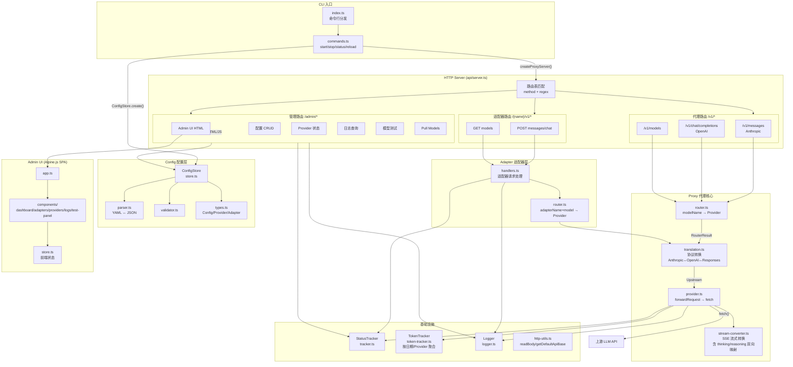

# llm-proxy 架构文档

## 概览

llm-proxy 是一个本地统一 LLM 模型代理，支持 Anthropic 和 OpenAI 协议的请求转发、协议互转、以及通过适配器（Adapter）暴露虚拟端点。

## 模块架构



## 分层职责

| 层级 | 源码路径 | 职责 |
|------|----------|------|
| **CLI 入口** | `src/cli/`, `src/index.ts` | 命令行解析，进程生命周期管理 |
| **HTTP 路由** | `src/api/server.ts` | 单端口 HTTP Server，正则路由表匹配分发 |
| **配置管理** | `src/config/` | YAML 加载、校验、热重载，Mutex 保护并发写 |
| **代理核心** | `src/proxy/` | 模型路由、Anthropic↔OpenAI 协议互转、上游转发、SSE 流转换 |
| **适配器层** | `src/adapter/` | 虚拟端点 `/{name}/v1/...`，内部映射到真实 Provider |
| **Admin UI** | `src/api/admin/` | Alpine.js SPA：Provider/Adapter/日志/测试面板/协议抓包 |
| **基础设施** | `src/status/`, `src/log/`, `src/lib/`, `src/proxy/capture.ts` | 状态统计、Token追踪、结构化日志、协议抓包、HTTP 工具函数 |

## 核心请求流

### 1. 直接代理

```
POST /v1/messages | /v1/chat/completions | /v1/responses
  → checkProxyAuth (若 proxy_key 已配置)
  → handleProxyRequest
  → readBody (解析 JSON)
  → routeModel(store, modelName) 按 model.id 匹配 Provider
  → transformInboundRequest 协议转换（跨协议时）
  → forwardRequest → fetch(上游 API)
     → 非流式: 提取 usage → TokenTracker.record()
     → 流式: converter 返回 StreamUsage → TokenTracker.record()
  → 响应：流式 SSE / 非流式 JSON（必要时做响应体协议转换）
```

### 2. 适配器代理

```
POST /{name}/v1/messages 或 POST /{name}/v1/chat/completions
  → handleAdapterRequest
  → resolveAdapterRoute(store, adapterName, toolModelName)
     → 查找 AdapterConfig → 查找 modelMapping → 查找 Provider → 构建 RouterResult
  → 复用 transformInboundRequest + forwardRequest
```

### 3. 管理 API

| 端点 | 方法 | 功能 |
|------|------|------|
| `/admin/` | GET | Admin UI 页面 |
| `/admin/config` | GET | 获取当前配置 |
| `/admin/config/reload` | POST | 热重载配置 |
| `/admin/health` | GET | 健康检查 |
| `/admin/status/providers` | GET | Provider 状态统计 |
| `/admin/logs` | GET | 查询日志 |
| `/admin/log-level` | GET/PUT | 日志级别（持久化到 config.yaml） |
| `/admin/token-stats` | GET | Token 用量统计（今日/历史/按 Provider） |
| `/admin/debug/captures` | GET | 协议抓包数据 |
| `/admin/debug/captures/stream` | GET | 抓包 SSE 实时推送 |
| `/admin/proxy-key` | GET/PUT | 代理 API Key |
| `/admin/adapters` | GET/POST/PUT/DELETE | 适配器 CRUD |
| `/admin/providers` | POST/PUT/DELETE | Provider CRUD |
| `/admin/test-model` | POST | 模型连通性测试 |
| `/admin/providers/{name}/pull-models` | POST | 拉取远端模型列表 |

### 4. 跨协议 thinking ↔ reasoning 转换链路

```
第N轮 (streaming):
  客户端 Anthropic SSE
    → Proxy (convertMessagesToOpenAI: thinking→reasoning_content)
    → OpenAI 上游 API
    ← Proxy (convertOpenAIStreamToAnthropic:
         reasoning_content→thinking_delta,
         reasoning_signature→signature_delta,
         thinking=index0, text=index1)
    ← 客户端 存储 thinking 块

第N+1轮:
  客户端 携带 thinking 块
    → Proxy (convertMessagesToOpenAI: thinking→reasoning_content+signature)
    → OpenAI 上游 API ✓ reasoning_content 存在
```

关键约束：Anthropic 流式输出中 thinking 块使用 index=0，text 块使用 index=1，
每个块独立完成 content_block_start → delta → stop 生命周期。

### 5. CLI 命令

| 命令 | 实现 |
|------|------|
| `llm-proxy start` | 加载配置 → 创建 ConfigStore/StatusTracker/Logger → 启动 HTTP Server |
| `llm-proxy stop` | 读取 PID 文件 → kill SIGTERM |
| `llm-proxy status` | 检查 PID 文件 + process.kill(pid, 0) |
| `llm-proxy reload` | `fetch POST /admin/config/reload` |

## 配置模型

```typescript
Config {
  providers: Provider[]    // 上游 LLM 提供商
  adapters?: AdapterConfig[]  // 虚拟适配器端点
  proxyKey?: string        // 可选，代理 API 密钥
  logLevel?: string        // 可选，日志级别 (debug/info/warn/error)
}

Provider {
  name, type(anthropic|openai|openai-responses), apiKey, apiBase?, models[]
}

AdapterConfig {
  name, type(anthropic|openai), models: AdapterModelMapping[]
}

AdapterModelMapping {
  sourceModelId: string   // 工具看到的模型名
  provider: string        // 指向的 Provider name
  targetModelId: string   // 实际请求的模型名
}
```

## 技术栈

- **运行时**: Node.js >= 20, TypeScript, ESM
- **依赖**: `alpinejs` (Admin UI), `yaml` (配置解析)
- **构建**: `tsc` + `esbuild` (Admin UI 前端打包)
- **测试**: Node.js 原生 test runner + `tsx`
