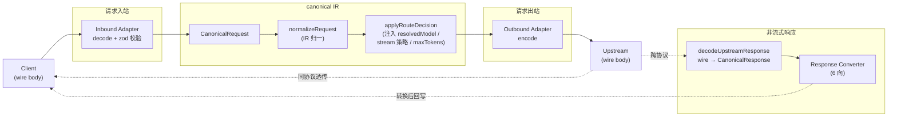
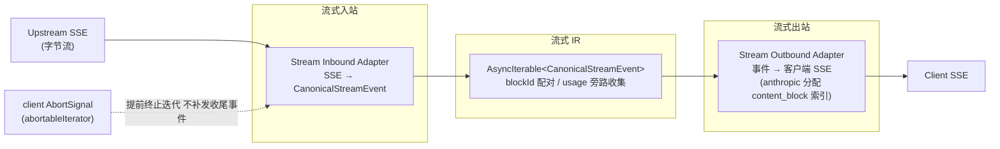

# 协议层架构（Protocol Layer）

> 适用版本：P1 协议核心重写后（Hono + canonical IR + 三协议适配器）。
> 字段/契约的**唯一事实来源是源码**：`src/proxy/ir/types.ts`、`src/proxy/ir/stream-events.ts`、
> `src/proxy/adapters/index.ts`。本文是导航与概览，细节以这些文件为准。

## 1. 设计思想

llm-proxy 的协议转换不是 N×N 的协议两两直连，而是以 **canonical IR（中间表示）** 为中枢：

- 任意入站协议 →（inbound 适配器）→ `CanonicalRequest` →（IR 归一 + 路由决策）→（outbound 适配器）→ 任意上游协议。
- 响应逆向：上游响应 →（解码）→ `CanonicalResponse` →（response 转换器）→ 客户端协议。
- 流式：上游 SSE →（stream inbound）→ `CanonicalStreamEvent` 异步流 →（stream outbound）→ 客户端 SSE。

三协议指 `ClientProtocol = 'anthropic' | 'openai' | 'openai-responses'`（`openai` 即 Chat Completions）。
IR 零运行时依赖、纯类型，独立于任何协议与运行时；块在 IR 里有稳定 `blockId`，协议相关索引
（如 Anthropic `content_block` 索引）不进 IR，由出站适配器在写出时分配。

## 2. 数据流总览

### 2.1 请求 / 非流式响应

要点：

- **同协议透传**：入站协议 == 上游协议时，非流式响应原文回写，不经 IR（`pipeline.ts`）。
- **跨协议转换**：上游响应先经 `src/proxy/response-decode.ts` 归一为 `CanonicalResponse`，
  再由 `src/proxy/adapters/response/converters.ts` 的 6 向转换器编码为客户端协议。
- `response-decode.ts` 位于 `src/proxy/`（而非 `adapters/response/`）：基线 response 适配器只提供
  `CanonicalResponse → wire` 的正向编码，反向解码是跨协议管线补充的，后续若沉淀为正式 response
  inbound adapter 应迁入 `adapters/response/`。

### 2.2 流式响应

要点：

- 块用稳定 `blockId` 配对（`block_start`/`block_delta`/`block_stop`）；Anthropic 出站适配器据此分配
  `content_block` 索引（thinking=0 → text=1 → tool_use=2+）并补 `content_block_stop`。
- 签名独立成 `block_signature` 事件，在 thinking delta 之后、`block_stop` 之前发出。
- **客户端断连**：`src/proxy/stream/abort.ts` 的 `abortableIterator` 透传 `AbortSignal`，abort 时提前终止
  上游迭代且**不补发** `message_stop`，供上层区分「正常 EOF」与「被截断」。

## 3. canonical IR 关键字段（简表）

详情见 `src/proxy/ir/types.ts` 与 `src/proxy/ir/stream-events.ts`。

### CanonicalRequest（请求入口）

| 字段 | 类型 | 说明 |
|------|------|------|
| `clientProtocol` | `ClientProtocol` | 入站协议 |
| `logicalModel` | `string` | 客户端原始 model（路由源键） |
| `resolvedModel?` | `ResolvedTarget` | 路由解析后注入（providerId/providerProtocol/modelId/apiBase） |
| `messages` | `CanonicalMessage[]` | 统一消息（role + blocks） |
| `system?` | `string \| SystemBlock[]` | 系统提示（anthropic 可多块） |
| `tools?` / `toolChoice?` | `CanonicalTool[]` / `CanonicalToolChoice` | 工具定义与选择 |
| `generation` | `GenerationSpec` | maxTokens/temperature/topP/stopSequences/**stream（非空布尔）** |
| `reasoning?` | `ReasoningSpec` | 归一后的推理策略 |
| `metadata?` | object | traceId/requestId 等 |

### CanonicalBlock（统一内容块）

`text` / `thinking`（含 signature + signatureSource）/ `reasoning` / `tool_use` / `tool_result` /
`image` / `file` / `audio` —— 8 种 kind 承载三协议全部内容形态。

### ReasoningSpec（推理归一）

| 字段 | 说明 |
|------|------|
| `enabled?` | 总开关 |
| `effort?` | 5 级 canonical effort：`low\|medium\|high\|xhigh\|max` |
| `budgetTokens?` | anthropic 语义预算 |
| `type?` | 透传型 thinking.type：`enabled\|disabled\|adaptive\|auto` |
| `summary?` | openai-responses 语义（anthropic 忽略） |
| `source` | 决策来源：`client\|route\|override` |
| `clientEffort?` | 反向保留客户端原始 effort（跨协议查表） |

三协议落点：anthropic = `enabled + budgetTokens`（或 `type=disabled`）；openai-chat = `enabled + effort`
（`reasoning_effort` 字符串，无签名）；openai-responses = `enabled + effort + summary`（reasoning item 独立成块）。

### CanonicalResponse（响应）

`model` / `message`（CanonicalMessage）/ `stopReason`（`end_turn|tool_use|max_tokens|stop_sequence|
content_filter|error`）/ `finishReason`（`completed|incomplete|failed`）/ `usage?` / `raw?`。

### CanonicalStreamEvent（流式事件）

| 事件 | 关键字段 |
|------|----------|
| `message_start` | `message` |
| `block_start` | `blockId` / `index` / `block` |
| `block_delta` | `blockId` / `delta`（text/thinking/reasoning_summary/tool_input_json/tool_input_action/image_ref） |
| `block_signature` | `blockId` / `signature` / `source`（original\|generated） |
| `block_stop` | `blockId` |
| `message_delta` | `stopReason?` / `usage?`（可分多次到达，管线合并） |
| `message_stop` | `stopReason` / `finishReason` |
| `error` | `error.{type,message,retryable?}`（retryable 供 P3 failover） |

## 4. 适配器边界

| 适配器 | 方向 | 职责 | 文件位置 |
|--------|------|------|----------|
| **inbound** | 请求入站 | wire body →（zod 结构校验，不信任 wire）→ `CanonicalRequest` | `src/proxy/adapters/inbound/{anthropic,openai-chat,openai-responses}.ts`（+ `_shared.ts` / `index.ts`） |
| **outbound** | 请求出站 | `CanonicalRequest` → 上游 wire body（注入目标协议 thinking/reasoning、max_tokens 兜底） | `src/proxy/adapters/outbound/{anthropic,openai-chat,openai-responses}.ts`（+ `index.ts`） |
| **response** | 非流式响应出站 | `CanonicalResponse` → 客户端 wire（6 向转换器） | `src/proxy/adapters/response/converters.ts` |
| **response 反向解码** | 非流式响应入站 | 上游 wire → `CanonicalResponse`（+ `extractWireUsage`），跨协议转换前置 | `src/proxy/response-decode.ts` |
| **stream inbound** | 流式入站 | 上游 SSE 字节流 → `CanonicalStreamEvent` 异步迭代（可透传 `AbortSignal`） | `src/proxy/stream/inbound/{anthropic,openai-chat,openai-responses}.ts` |
| **stream outbound** | 流式出站 | `CanonicalStreamEvent` → 客户端 SSE；anthropic 在此分配 content_block 索引、生成伪签名 | `src/proxy/stream/outbound/{anthropic,openai-chat,openai-responses}.ts` |
| **ccx/namespace** | 工具命名空间 | MCP/CCX 工具的 `namespace__name` 展平与还原（`buildNamespaceToolContext` / `decodeNs` / `encodeNs`） | `src/proxy/adapters/ccx/namespace.ts` |

适配器公共契约（`src/proxy/adapters/index.ts`）：`InboundAdapter` / `OutboundAdapter` /
`StreamInboundAdapter` / `StreamOutboundAdapter`，以及路由契约 `RouteDecision` / `StreamPolicy`、
错误契约 `ProxyError` / `RetryableErrorJudge`（重试判定实现于 P3）。

### 编排点

- 适配器注册表按协议索引：`pipeline.ts` 的 `INBOUND_ADAPTERS` / `OUTBOUND_ADAPTERS` /
  `STREAM_INBOUND_ADAPTERS` / `STREAM_OUTBOUND_ADAPTERS`（基线适配器只读消费）。
- IR 归一：`src/proxy/ir/canonicalize.ts` `normalizeRequest`（tool role → user、thinking 签名来源显式化、
  合并相邻同 role 消息、工具 namespace 展平一致性）。
- 路由决策：`src/proxy/router.ts`（`routeModel` / `resolveAdapterRoute` / `resolveStreamPolicy` /
  `toReasoningSpec`）。

## 5. thinking 签名约定

跨协议多轮对话回传 thinking 时签名必须一致：

- 上游原始签名可用 → `signatureSource: 'original'`，原样透传。
- Chat 等无签名协议 → `signatureSource: 'generated'`，anthropic 出站用 `makeSignature(text)`
  （SHA-256 前 16 字符 hex，`src/proxy/stream/outbound/anthropic.ts`）生成确定性伪签名，相同文本多轮一致。
- 无签名且不需要 → `signatureSource: 'none'`（`normalizeRequest` 会显式化未标注的块）。
