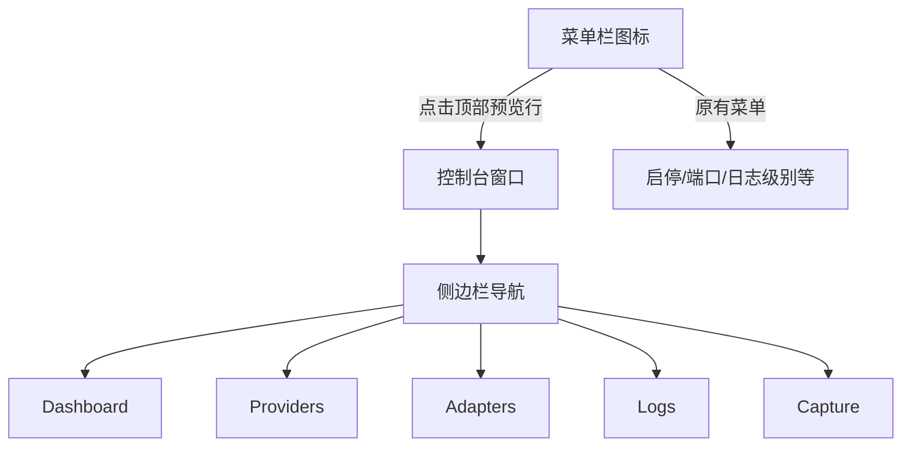

# macOS 原生管理控制台

## Problem Frame

llm-proxy 当前的管理界面是浏览器中的 Web Admin UI（`localhost:9000/admin`）。用户需要手动打开浏览器、输入地址才能查看 Dashboard、管理 Providers/Adapters、查看日志、调试抓包。这个流程打断开发心流，且 Web 页面无法常驻桌面。

**目标**：在 macOS 菜单栏 App 中新增原生管理控制台窗口，完整复刻 Web Admin UI 的 5 个功能 tab，让用户无需离开桌面环境即可完成所有管理操作。

---

## Requirements

### 窗口框架

- R1. 菜单栏顶部新增一行 Dashboard 预览（服务状态灯 + 今日请求数），点击预览行呼出控制台窗口
- R2. 控制台窗口使用 macOS 原生侧边栏导航（左侧图标+文字列表，右侧内容区）
- R3. 侧边栏包含 5 个 tab：Dashboard、Providers、Adapters、Logs、Capture
- R4. 窗口在关闭时可隐藏而非销毁，再次点击菜单栏预览行时恢复（保持上次 tab 选择）
- R5. 窗口框架实现阶段，未实现的 tab 显示"即将推出"占位视图

### Dashboard

- R6. 显示服务运行状态指示（绿色运行/红色离线），实时更新
- R7. 显示 Provider 数量、模型总数、Adapter 数量统计卡片
- R8. 显示今日 Token 用量统计：请求数、输入 Token、输出 Token、缓存命中数/率、缓存创建数
- R9. Token 用量数据每 10 秒自动刷新（复用已有 `/admin/token-stats` 端点）

### Providers 管理

- R10. 列表展示所有 Provider（名称、类型、状态、模型数），支持搜索过滤
- R11. 支持新增/编辑 Provider（名称、类型选择 openai/anthropic/openai-responses、API Key、API Base、模型列表）
- R12. 模型列表支持增删行，每个模型可配置 thinking 参数
- R13. 支持从 API 拉取模型列表（pull models），显示已有/新增模型并一键导入
- R14. 支持删除 Provider（带确认弹窗）
- R15. 支持测试 Provider 连通性（发送测试请求，显示延迟和可达状态）

### Adapters 管理

- R16. 列表展示所有 Adapter（名称、类型、模型映射数量），支持搜索过滤
- R17. 支持新增/编辑 Adapter（名称、类型选择、模型映射列表）
- R18. 模型映射支持选择 Provider 和 Target Model，每个映射独立配置
- R19. 支持删除 Adapter（带确认弹窗）
- R20. 支持测试 Adapter 连通性

### Logs 日志查看

- R21. 实时展示结构化日志列表（时间戳、级别、类型、消息），颜色区分级别
- R22. 支持按日志级别过滤（debug/info/warn/error）、按类型过滤（request/response/system 等）
- R23. 支持关键词搜索过滤
- R24. 支持分页浏览（每页 50 条）
- R25. 日志列表自动滚动到最新，用户手动上滚时暂停自动滚动

### Capture 抓包调试

- R26. 提供开始/停止抓包开关
- R27. 实时 SSE 流展示抓包条目列表（时间、来源方向、数据大小）
- R28. 点击条目展示请求/响应详细内容（JSON 格式化、语法高亮）
- R29. 支持按来源过滤抓包条目
- R30. 支持左右对比视图（客户端↔代理 vs 代理↔上游）

---

## Success Criteria

- 用户无需打开浏览器即可查看 llm-proxy 健康状态和 Token 用量
- 用户可在原生窗口中完成 Provider/Adapter 的完整 CRUD 操作
- 用户可在原生窗口中实时查看日志和调试抓包
- 控制台窗口响应流畅，数据刷新不卡顿
- 菜单栏原有功能（启停、端口切换等）不受影响

---

## Scope Boundaries

- 菜单栏现有功能（服务启停、端口/日志级别切换、语言切换、更新检查）保持不变，不在本次范围内
- 不涉及后端 API 改动——所有功能复用已有 `/admin/*` 端点
- 不涉及 macOS Widget、通知、Shortcuts 等扩展功能
- Proxy Key 设置暂不纳入（低频操作，后续版本添加）
- 测试面板（发送自定义测试请求）暂不纳入

---

## Key Decisions

- **窗口模式：菜单栏 + 独立窗口**：参考 Docker Desktop，菜单栏做快速状态入口，独立窗口做完整管理
- **技术路线：AppKit 外壳 + SwiftUI 内容**：保持现有 AppKit NSMenu 不变，窗口用 `NSWindowController` + `NSHostingView` 嵌入 SwiftUI 视图
- **导航方式：macOS 侧边栏**：左侧图标+文字列表，类似系统设置
- **实现策略：框架先行，Tab 逐个填充**：先建窗口框架+5 个 tab 占位，再按 Dashboard → Logs → Providers → Adapters → Capture 顺序逐个实现

---

## Dependencies / Assumptions

- 后端 `/admin/*` API 全部就绪且稳定，无需改动
- APIClient 可扩展新端点（token-stats、logs、capture SSE 等）
- macOS 13+ 兼容（NSHostingView 自 macOS 11 可用）
- 现有双语基础设施（`loc()` + `en.lproj`/`zh.lproj`）可直接复用

---

## Outstanding Questions

### Deferred to Planning

- [Affects R4][Technical] 窗口隐藏/恢复策略：NSWindowController 单例 vs 每次新建
- [Affects R21][Technical] 日志实时更新：轮询 vs SSE 长连接
- [Affects R27][Technical] Capture SSE 流在 Swift 中的实现方案：URLSession streaming vs 第三方库
- [Affects R28][Technical] JSON 语法高亮方案：SwiftUI Text 富文本 vs WebView 嵌入 Monaco Editor
- [Affects R2][Technical] 侧边栏具体实现：纯 SwiftUI NavigationSplitView vs 自定义 SplitView
- [Affects R15][Needs research] Provider 连通性测试已有 `/admin/test-model` 端点，需确认返回格式

---

## Next Steps

-> `/ce-plan` 进行结构化实现规划，分解为实现单元并排优先级
