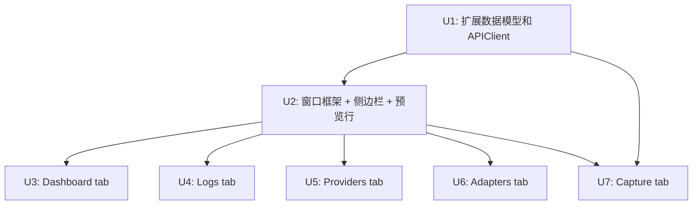

# feat: macOS 原生管理控制台

## Overview

在 llm-proxy macOS 菜单栏 App 中新增原生管理控制台窗口，完整复刻 Web Admin UI 的 5 个功能 tab（Dashboard、Logs、Providers、Adapters、Capture），让用户无需打开浏览器即可完成所有管理操作。

技术路线：AppKit 外壳 + SwiftUI 内容。现有 NSMenu 保持不变，新增 `NSWindowController` + `NSHostingView` 嵌入 SwiftUI 视图，macOS 侧边栏导航。

---

## Problem Frame

当前管理操作依赖浏览器打开 `localhost:9000/admin`，打断开发心流。macOS 原生窗口可常驻桌面、即时响应、系统级集成，大幅改善使用体验。所有功能复用已有 `/admin/*` REST API 端点，后端零改动。

---

## Requirements Trace

- R1. 菜单栏顶部 Dashboard 预览行，点击呼出控制台窗口
- R2. macOS 侧边栏导航，5 个 tab
- R3. 侧边栏包含 Dashboard、Providers、Adapters、Logs、Capture
- R4. 窗口关闭时销毁（非隐藏），再次点击重新创建
- R5. 未实现 tab 显示"即将推出"占位
- R6-R9. Dashboard：服务状态、Provider/模型/Adapter 计数、Token 用量统计、10 秒刷新
- R10-R15. Providers：列表+搜索、CRUD、模型管理、pull models、删除确认、连通性测试
- R16-R20. Adapters：列表+搜索、CRUD、模型映射、删除确认、连通性测试
- R21-R25. Logs：实时日志、级别/类型过滤、搜索、分页、自动滚动
- R26-R30. Capture：启停开关、SSE 实时流、条目列表、JSON 详情、来源过滤、左右对比

**Origin actors:** A1. llm-proxy 用户（开发者）
**Origin flows:** F1. 查看 Dashboard（菜单栏预览 → 窗口 → 侧边栏 → Dashboard）、F2. 管理 Provider（窗口 → 侧边栏 → Providers → CRUD 表单）
**Origin acceptance examples:** AE1 (R1+R6 菜单栏预览+点击), AE2 (R10 新增 Provider), AE3 (R26 抓包启停)

---

## Scope Boundaries

- 菜单栏现有功能（启停、端口/日志级别切换、语言、更新）保持不变
- 不涉及后端 API 改动
- 不涉及 macOS Widget、通知、Shortcuts 扩展
- Proxy Key 设置暂不纳入
- 测试面板暂不纳入
- macOS 13+ 兼容

---

## Context & Research

### Relevant Code and Patterns

- `app/Sources/MenuBarController.swift` — @MainActor Task 异步模式、rebuildMenu() 全量重建、pollTimer 5 秒轮询、loc() 双语本地化
- `app/Sources/APIClient.swift` — URLSession + async/await、JSONDecoder 解析、PUT/POST 请求、端口/UserDefaults 持久化
- `app/Sources/Models.swift` — Codable struct 模式（Adapter、Provider、ConfigResponse 等）
- `app/Sources/AppDelegate.swift` — NSApplicationDelegate、accessory 激活策略
- `app/Package.swift` — Swift PM、macOS 13+、executableTarget
- `src/api/handlers/index.ts` — 28 条 /admin/* 路由导出，全部就绪
- `src/api/admin/components/` — Web UI 各 tab 的 Alpine.js 实现（数据模型、交互逻辑参考）
- `docs/plans/2026-05-17-001-feat-auto-update-plan.md` — 菜单栏 UI 扩展模式参考

### Institutional Learnings

`docs/solutions/` 目录不存在，无已有经验记录。本次工作完成后建议沉淀关键决策为 institutional learning。

### External References

未使用外部研究。技术选型（NSHostingView、NavigationSplitView）基于 Apple 官方文档，用户已明确架构方向。

---

## Key Technical Decisions

- **窗口生命周期：创建即用，关闭即销毁**：简化内存管理，避免隐藏窗口的状态同步问题。窗口打开时重新拉取最新数据
- **AppKit 外壳 + SwiftUI 内容**：保持现有 AppKit 基础设施不变（NSApplication、NSMenu），窗口内容用 SwiftUI 实现。桥接层：`NSWindowController` 子类持有一个 `NSHostingView` 包裹的 SwiftUI 根视图
- **侧边栏用 NavigationSplitView**：macOS 原生侧边栏组件，支持 sidebar + detail 两栏布局，系统级折叠/展开行为
- **数据流：每个 tab 独立 ViewModel**：用 `@Observable` 类管理状态和 API 调用，不建全局 Store（避免过度抽象，每个 tab 数据独立）
- **SSE 用 URLSession 手动实现**：不引入第三方库。`URLSession.shared.bytes(for:)` 逐行读取 SSE 流
- **JSON 显示用 SwiftUI Text + 等宽字体**：v1 不做语法高亮（Monaco Editor 需要 WebView，与原生路线冲突），显示格式化 JSON 文本即可
- **完整 XCTest 覆盖**：Models 解析、APIClient 方法、ViewModel 状态逻辑均需测试

---

## Open Questions

### Resolved During Planning

- 窗口生命周期：每次新建 + 关闭销毁
- 测试策略：完整 XCTest 覆盖（Models + APIClient + ViewModel）
- 数据架构：每个 tab 独立 ViewModel，不建全局 Store
- JSON 显示方案：等宽字体 Text 展示格式化 JSON，不做 Monaco Editor

### Deferred to Implementation

- [R4] 窗口位置记忆（是否记住上次位置）：实现时根据用户反馈决定
- [R21] 日志实时更新策略（轮询 vs SSE）：先用轮询实现，SSE 作为后续优化
- [R23] 搜索 debounce 时间：实现时调整
- [R7] Token 统计数字格式化（K/M 缩写）：参考 Web UI 的 fmtNum 逻辑

---

## Dependency Graph

**并行化策略**：
- **串行**：U1 → U2（U2 依赖 U1 的数据模型和 APIClient）
- **并行**：U3、U4、U5、U6 可在 U2 完成后同时通过 subagent 并行开发（各自独立 ViewModel + View，互不干扰）
- **并行**：U7 也可与 U3-U6 并行（依赖 U1 的 CaptureSSEClient + U2 的窗口入口）
- 预计可用 5-6 个 subagent 并行实现 U3-U7，大幅缩短总工期

---

## Implementation Units

- [ ] U1. **扩展数据模型和 APIClient**

**Goal:** 为所有 tab 准备数据基础：新增 Models 类型和 APIClient 端点方法

**Requirements:** R6-R30（数据基础）

**Dependencies:** None

**Files:**
- Modify: `app/Package.swift` — 新增 .testTarget 定义
- Modify: `app/Sources/Models.swift` — 新增 TokenStats、TokenRecord、LogEntry、CaptureEntry、ProviderDetail 等类型；新增 AnyCodable 工具类型用于 LogEntry.details
- Modify: `app/Sources/APIClient.swift` — 新增 fetchTokenStats、fetchLogs、fetchCaptureStatus、setCaptureControl、fetchProviders、createProvider、updateProvider、deleteProvider、pullModels、testModel、createAdapter、updateAdapter、deleteAdapter、testAdapter 等方法
- Create: `app/Sources/CaptureSSEClient.swift` — SSE 流读取封装
- Create: `app/Tests/LLMProxyTests/ModelsTests.swift`
- Create: `app/Tests/LLMProxyTests/APIClientTests.swift`

**Approach:**
- Models.swift 按 tab 分组新增 struct，全部遵循 Codable，字段严格对齐后端响应格式：
  - `TokenStats`：today (TokenRecord)、history ([TokenRecord])、byProvider ([String: TokenRecord])
  - `TokenRecord`：date、input_tokens、output_tokens、cache_read_input_tokens、cache_creation_input_tokens、request_count
  - `LogEntry`：id (Int)、timestamp (String)、type (String: "request"|"system")、level (String: "debug"|"info"|"warn"|"error")、message (String)、details ([String: AnyCodable]?)
  - `CaptureEntry`：按 capture.ts 的 SSE 推送格式定义
  - Provider Model 的 thinking：budget_tokens (Int?) 和 reasoning_effort (String?)，互斥可选，用自定义 Codable 处理
- Package.swift 新增 `.testTarget(name: "LLMProxyTests", dependencies: ["LLMProxy"], path: "Tests/LLMProxyTests")`
- APIClient 新增方法遵循现有模式（async throws、JSONDecoder、PUT/POST with JSON body）
- SSE 客户端用 `URLSession.shared.bytes(for:delegate:)` 逐行解析 `data:` 前缀行
- 测试覆盖：JSON 解析正确性、请求 URL/方法/body 构造、SSE 行解析、错误处理

**Patterns to follow:**
- `app/Sources/Models.swift` 现有 Adapter、Provider 等 Codable struct
- `app/Sources/APIClient.swift` 现有 fetchConfig、fetchAdapters 等方法

**Test scenarios:**
- Happy path: TokenStats JSON 解析 → 各字段正确映射；fetchLogs 构造正确的 GET 请求 URL
- Edge case: 空模型列表、缺失可选字段的 JSON 解析不崩溃
- Error path: 网络错误时 APIClient 方法抛出；SSE 行格式错误时安全跳过
- Integration: APIClient 返回的 ConfigResponse 与 Models 类型完全兼容

**Verification:**
- 所有新 Models 类型可正确解析后端实际返回的 JSON（对照 src/api/handlers/ 响应格式）
- 所有新 APIClient 方法通过 URLRequest 构造验证和 JSON 解码验证
- `swift test` 全部通过

---

- [ ] U2. **创建控制台窗口框架 + 侧边栏 + 菜单栏预览行**

**Goal:** 建好窗口基础设施，侧边栏可切换 5 个 tab（未实现 tab 显示占位），菜单栏顶部新增 Dashboard 预览行

**Requirements:** R1, R2, R3, R4, R5

**Dependencies:** U1

**Files:**
- Create: `app/Sources/ConsoleWindowController.swift` — NSWindowController 子类
- Create: `app/Sources/ConsoleRootView.swift` — SwiftUI 根视图（NavigationSplitView + 侧边栏）
- Create: `app/Sources/Views/DashboardView.swift` — Dashboard 占位视图
- Create: `app/Sources/Views/LogsView.swift` — Logs 占位视图
- Create: `app/Sources/Views/ProvidersView.swift` — Providers 占位视图
- Create: `app/Sources/Views/AdaptersView.swift` — Adapters 占位视图
- Create: `app/Sources/Views/CaptureView.swift` — Capture 占位视图
- Create: `app/Sources/Views/PlaceholderView.swift` — 通用占位组件
- Modify: `app/Sources/MenuBarController.swift` — rebuildMenu() 顶部新增预览行
- Modify: `app/Sources/AppDelegate.swift` — 添加窗口入口
- Create: `app/Tests/LLMProxyTests/ConsoleWindowControllerTests.swift`
- Create: `app/Tests/LLMProxyTests/MenuBarPreviewTests.swift`

**Approach:**
- 窗口：800×600，标题"llm-proxy 控制台"，居中显示，每次新建
- NavigationSplitView：sidebar 宽度 ~180px，用 SwiftUI List + Label（SF Symbol + 文字）
- 侧边栏 5 个条目：Dashboard、Providers、Adapters、Logs、Capture，点击切换 detail 视图
- 菜单栏预览行：绿色/灰色状态灯 + "今日 N 请求"，NSAttributedString 着色，点击触发 `openConsole()`
- MenuBarController 持有可选的 ConsoleWindowController 引用，关闭时置 nil

**Patterns to follow:**
- `app/Sources/MenuBarController.swift` rebuildMenu() 的 NSAttributedString + SF Symbol 模式
- `app/Sources/AppDelegate.swift` 的 @MainActor 入口模式

**Test scenarios:**
- Happy path: 点击菜单栏预览行 → 窗口出现；侧边栏切换 → detail 视图切换；关闭窗口 → 窗口销毁
- Edge case: 重复点击预览行 → 创建新窗口（旧窗口已销毁）；快速切换 tab 不崩溃
- Integration: 窗口打开时菜单栏预览行仍然响应；窗口关闭后 MenuBarController 的 consoleWindowController 为 nil

**Verification:**
- 菜单栏新增预览行，点击打开控制台窗口
- 侧边栏 5 个 tab 可切换，未实现 tab 显示"即将推出"
- 窗口关闭后状态正确重置，再次点击可重新打开

---

- [ ] U3. **Dashboard tab 完整实现**

**Goal:** Dashboard 显示服务状态、统计计数、Token 用量，10 秒自动刷新

**Requirements:** R6, R7, R8, R9

**Dependencies:** U2

**Files:**
- Modify: `app/Sources/Views/DashboardView.swift` — 替换占位，实现完整 Dashboard
- Create: `app/Sources/ViewModels/DashboardViewModel.swift` — @Observable 状态管理
- Create: `app/Tests/LLMProxyTests/DashboardViewModelTests.swift`

**Approach:**
- DashboardViewModel：@Observable 类，持有 health、config、tokenStats 状态，提供 load() 和 startPolling()/stopPolling()
- 轮询：Timer.scheduledTimer 每 10 秒调用 load()，窗口关闭时 stopPolling()
- UI 布局：顶部服务状态卡片（绿色/红色），中间 3 个统计卡片（Provider 数/模型数/Adapter 数），底部 Token 用量区（请求数、输入/输出 Token、缓存命中/创建）
- Token 数字用 fmtNum 格式化为 K/M 缩写
- 数据来源：/admin/health、/admin/config、/admin/token-stats

**Patterns to follow:**
- `app/Sources/MenuBarController.swift` pollTimer 轮询模式
- Web UI `dashboard.ts` 的 fmtNum/pct 格式化逻辑

**Test scenarios:**
- Happy path: load() 后 health/config/tokenStats 正确更新；轮询触发数据刷新
- Edge case: 服务离线时 health 为 false，显示"离线"状态
- Error path: API 请求失败时保持上次数据，不崩溃
- Integration: 窗口关闭时轮询停止；tokenStats 为空时不显示 Token 区块

**Verification:**
- Dashboard 显示服务状态、计数、Token 用量
- 数据每 10 秒自动刷新
- 离线时优雅降级

---

- [ ] U4. **Logs tab 完整实现**

**Goal:** 实时日志列表，支持级别过滤、类型过滤、搜索、分页、自动滚动

**Requirements:** R21, R22, R23, R24, R25

**Dependencies:** U2

**Files:**
- Modify: `app/Sources/Views/LogsView.swift` — 完整日志查看器
- Create: `app/Sources/ViewModels/LogsViewModel.swift` — @Observable 状态管理
- Create: `app/Tests/LLMProxyTests/LogsViewModelTests.swift`

**Approach:**
- LogsViewModel：管理 logs 数组、filter/levelFilter/search/page 状态、自动滚动标志
- 数据来源：/admin/logs（当前返回内存日志）
- 轮询：每 5 秒拉取新日志，追加到列表
- UI：顶部过滤栏（级别 Picker + 类型 Picker + 搜索 TextField），中间日志列表（时间戳、级别颜色标签、消息），底部分页控件
- 自动滚动：新日志到达时如果用户在底部则自动滚，用户手动上滚则暂停
- 日志级别颜色：debug=灰、info=蓝、warn=橙、error=红

**Patterns to follow:**
- Web UI `logs.ts` 的过滤/搜索/分页逻辑
- SwiftUI `ScrollViewReader` + `scrollTo` 实现自动滚动

**Test scenarios:**
- Happy path: 加载日志列表；级别过滤减少显示条目；搜索关键词匹配
- Edge case: 空日志列表显示"无日志"；切换过滤后分页重置到第 1 页
- Error path: API 错误时保持已有日志不丢失
- Integration: 日志列表自动滚动到底部；用户上滚后自动滚动暂停

**Verification:**
- 日志实时更新（5 秒轮询）
- 级别/类型过滤和搜索正确
- 分页可用
- 自动滚动行为正确

---

- [ ] U5. **Providers tab 完整实现**

**Goal:** Provider CRUD 管理，支持列表+搜索、新增/编辑表单、模型管理、pull models、连通性测试

**Requirements:** R10, R11, R12, R13, R14, R15

**Dependencies:** U2

**Files:**
- Modify: `app/Sources/Views/ProvidersView.swift` — 完整 Provider 管理
- Create: `app/Sources/ViewModels/ProvidersViewModel.swift` — @Observable 状态管理
- Create: `app/Sources/Views/ProviderFormView.swift` — 新增/编辑表单（Sheet）
- Create: `app/Tests/LLMProxyTests/ProvidersViewModelTests.swift`

**Approach:**
- ProvidersViewModel：管理 providers 列表、search、编辑状态、表单数据、pullModels 状态
- UI：顶部搜索栏 + 新增按钮，中间 Provider 列表（名称、类型标签、模型数、状态），每行有编辑/删除/测试按钮
- 新增/编辑：Sheet 弹出表单（名称、类型 Picker、API Key、API Base、模型列表增删行、thinking 配置）
- Pull models：从 API 拉取模型列表，显示已有/新增，勾选导入
- 删除：NSAlert 确认弹窗
- 测试：发送测试请求，显示延迟和可达状态

**Patterns to follow:**
- Web UI `providers.ts` 的 CRUD 逻辑和表单结构
- `app/Sources/MenuBarController.swift` showError() 的 NSAlert 模式

**Test scenarios:**
- Happy path: 加载列表；新增 Provider 成功；编辑保存成功；删除确认后成功
- Edge case: 空模型列表保存时提示验证错误；API Key 为空时新增提示
- Error path: API 错误时显示错误信息不崩溃；pull models 失败时显示错误
- Integration: 新增 Provider 后列表刷新；测试结果显示延迟和状态

**Verification:**
- Provider 列表可搜索过滤
- 新增/编辑表单完整（名称、类型、API Key、模型列表）
- Pull models 工作正常
- 删除有确认弹窗
- 连通性测试可用

---

- [ ] U6. **Adapters tab 完整实现**

**Goal:** Adapter CRUD 管理，支持列表+搜索、新增/编辑表单、模型映射配置、连通性测试

**Requirements:** R16, R17, R18, R19, R20

**Dependencies:** U2

**Files:**
- Modify: `app/Sources/Views/AdaptersView.swift` — 完整 Adapter 管理
- Create: `app/Sources/ViewModels/AdaptersViewModel.swift` — @Observable 状态管理
- Create: `app/Sources/Views/AdapterFormView.swift` — 新增/编辑表单（Sheet）
- Create: `app/Tests/LLMProxyTests/AdaptersViewModelTests.swift`

**Approach:**
- AdaptersViewModel：管理 adapters 列表、search、编辑状态、表单数据、providers 引用
- UI：顶部搜索栏 + 新增按钮，中间 Adapter 列表（名称、类型、映射数），每行编辑/删除/测试
- 新增/编辑：Sheet 表单（名称、类型 Picker、模型映射列表——每行选择 sourceModelId + Provider + targetModelId）
- 模型映射需要读取 Providers 列表来填充下拉选项
- 删除：NSAlert 确认弹窗
- 测试：发送测试请求

**Patterns to follow:**
- Web UI `adapters.ts` 的 CRUD 逻辑和模型映射交互
- U5 Providers tab 的表单 Sheet 模式

**Test scenarios:**
- Happy path: 加载列表；新增 Adapter 含模型映射成功；删除确认后成功
- Edge case: 空模型映射时保存提示验证错误
- Error path: API 错误时显示错误不崩溃
- Integration: Provider 列表变化后 Adapter 表单中的下拉选项同步更新

**Verification:**
- Adapter 列表可搜索过滤
- 新增/编辑表单完整（名称、类型、模型映射行增删）
- 删除有确认弹窗
- 连通性测试可用

---

- [ ] U7. **Capture tab 完整实现**

**Goal:** 抓包启停开关、SSE 实时流、条目列表、JSON 详情、来源过滤、左右对比视图

**Requirements:** R26, R27, R28, R29, R30

**Dependencies:** U2, U1（CaptureSSEClient）

**Files:**
- Modify: `app/Sources/Views/CaptureView.swift` — 完整抓包查看器
- Create: `app/Sources/ViewModels/CaptureViewModel.swift` — @Observable 状态管理
- Create: `app/Tests/LLMProxyTests/CaptureViewModelTests.swift`
- Create: `app/Tests/LLMProxyTests/CaptureSSEClientTests.swift`

**Approach:**
- CaptureViewModel：管理 running/entries/selectedId/sourceFilter 状态，持有 CaptureSSEClient
- 启停：调用 /admin/debug/captures/control 切换 enabled，开启时建立 SSE 连接
- SSE 连接：用 CaptureSSEClient 连接 /admin/debug/captures/stream，解析 `data:` 行 JSON
- UI：顶部开关 + 来源过滤 Picker，左侧条目列表（时间、方向图标、大小），右侧详情面板
- 详情面板：选中条目时显示 formatted JSON（等宽字体 Text），支持左右对比（phase: requestIn/requestOut/responseIn/responseOut）
- 左右对比：HSplitView 左右两栏，分别显示"客户端↔代理"和"代理↔上游"的请求/响应

**Patterns to follow:**
- Web UI `capture.ts` 的 SSE 连接、条目列表、详情面板、phase 过滤逻辑
- U1 CaptureSSEClient 的 bytes 逐行解析
- `src/proxy/capture.ts` 后端 SSE 数据格式

**Test scenarios:**
- Happy path: 开启抓包 → SSE 连接建立 → 条目列表实时更新；关闭 → 连接断开
- Edge case: SSE 重连逻辑；空条目列表显示"无数据"
- Error path: SSE 连接失败时显示错误并自动重试；JSON 解析失败时安全跳过
- Integration: 来源过滤后条目列表正确筛选；选中条目详情正确显示

**Verification:**
- 抓包开关可正常启停
- SSE 流实时显示条目
- 点击条目查看 JSON 详情
- 来源过滤可用
- 左右对比视图正确

---

## System-Wide Impact

- **Interaction graph:** MenuBarController 新增 openConsole() 入口 → ConsoleWindowController 创建 → SwiftUI 视图树（NavigationSplitView → 5 个 tab View）
- **Error propagation:** APIClient 错误 → ViewModel 捕获 → UI 显示错误状态（不崩溃，不静默吞掉）
- **State lifecycle risks:** 窗口关闭时需停止所有 Timer（轮询）和 SSE 连接；ViewModel 随窗口销毁释放
- **Unchanged invariants:** 菜单栏现有功能完全不受影响；APIClient 原有方法不变；后端 API 不变

---

## Risks & Dependencies

| Risk | Mitigation |
|------|------------|
| SSE 实现复杂（手动字节流解析） | CaptureSSEClient 独立封装，可单独测试；失败不影响其他 tab |
| 5 个 tab 全部实现工作量大 | 框架先行（U2）后可并行开发各 tab；每个 tab 独立 ViewModel，互不阻塞 |
| JSON 详情显示无语法高亮（等宽字体文本） | v1 接受此限制；后续可评估用 AttributedString 做关键词着色 |
| Swift 侧无测试基础设施 | U1 中按 Package.swift 标准结构创建 Tests 目录和 XCTest 目标 |

---

## Documentation / Operational Notes

- 更新 `DEVELOPMENT.md` 添加 Swift 测试运行说明（`swift test`）
- 更新 `README.md` / `README.zh.md` 添加控制台功能介绍
- 双语字符串：所有面向用户文本使用 `loc()` 并在 `en.lproj`/`zh.lproj` 的 `Localizable.strings` 中添加

---

## Sources & References

- **Origin document:** [docs/brainstorms/2026-05-28-macos-native-admin-console-requirements.md](../brainstorms/2026-05-28-macos-native-admin-console-requirements.md)
- Related code: `app/Sources/MenuBarController.swift`, `app/Sources/APIClient.swift`, `app/Sources/Models.swift`
- Related docs: `src/api/handlers/index.ts` (API 端点清单), `src/api/admin/components/` (Web UI 参考实现)
- Prior plan: `docs/plans/2026-05-17-001-feat-auto-update-plan.md` (菜单栏扩展模式)
