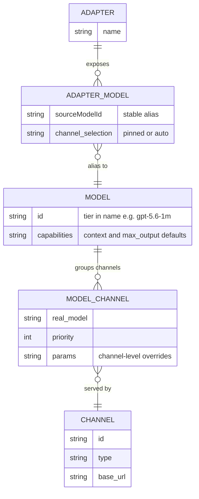

# AxonHub-Parity Orchestration Core - Plan

## Goal Capsule

- **Objective:** Build the orchestration core on llm-proxy's existing Provider+Adapter foundation: model-centric routing where a logical model (a "model group" bundling same-tier channels) is served by multiple channels with priority/failover/load-balancing; adapters expose stable per-app aliases that hide real model names; a declarative override engine configures backend behavior; reasoning resolution is centralized across the three protocols. Get the gateway to AxonHub-grade routing before adding custom logic.
- **Product authority:** This plan owns routing/model/channel orchestration + the override engine + reasoning centralization. Model management (`/v1/models`), cost accounting, observability, channel probing/circuit-breaking/rate-limiting, our custom reasoning templates/thinkingLevelMap, extra protocol providers, and the management UI are surrounding areas, not active scope.
- **Open blockers:** None. Key product decisions were settled in dialogue (see Key Decisions); remaining items are Deferred to Planning.

---

## Product Contract

### Summary

Add model-centric multi-channel routing to llm-proxy. A logical model groups the channels that serve it (each binding carries the channel-specific real model ID, priority, and capability tier); adapters expose stable per-app aliases so clients never see real model names or reconfigure when backends swap; a declarative override engine (borrowed from AxonHub) configures outbound request behavior; and reasoning resolution is centralized to remove the per-protocol drift inherited from P1. Multi-tenancy and auth stay out.

### Problem Frame

P1 translates three protocols end-to-end but routes one-to-one: an adapter alias maps to a single provider plus model. There is no failover, no load balancing, and no per-channel capability handling.

Real usage pulls the other direction. The same model is offered by many channels — kiro, cc, aggregators like OpenRouter — at different cost, speed, and context window. The operator wants to prioritize channels per model, fail over when one dies, and give each local application (pi, Claude, codex) its own adapter with fixed external model names. The client should never see the real model name and never need to reconfigure when the backend changes, because client-side model switching is awkward (config edits, reloads, some clients cannot easily change model).

AxonHub already solves the orchestration half — model-to-channels routing with priority, load balancing, failover, and a declarative override engine — but as a single-endpoint, multi-tenant gateway that exposes real model names to clients. We want its orchestration inside our per-app Adapter facade, not its single-endpoint model.

P1's reasoning handling also needs repair. The field-level reasoning merge is scattered across the three outbound adapters and drifts: Anthropic uses a budget-priority chain with an anti-semantic `Math.max` clamp, the two OpenAI protocols ignore budget/type/enabled entirely, and five-level effort values are not downgraded for protocols that reject them. This belongs in one resolver.

### Key Decisions

- KD1. Keep the Provider+Adapter dual-layer facade; do not adopt AxonHub's single-endpoint model. (session-settled: user-directed — chosen over AxonHub single-endpoint: per-app stable aliases that hide real model names fit personal multi-app use.) Governs R6, R7, R8, R9.
- KD2. Route by logical model: the model is the routing unit and a "model group" bundling its channels; channels are supply. (session-settled: user-directed — chosen over adapter-picks-provider-then-model: model-centric routing enables multi-channel failover and matches AxonHub's proven core.) Governs R1, R2, R3.
- KD3. A capability tier (e.g. context window) is part of the logical model's identity, not an alias-level filter; `gpt-5.6-1m` and `gpt-5.6-fast` are two distinct models, each grouping same-tier channels. (session-settled: user-directed — chosen over alias-carries-context-filter: encoding tier in the model name is simpler and needs no runtime capability filtering.) Governs R4, R5.
- KD4. Real upstream model IDs and the serving channel are hidden behind adapter aliases; any model-listing surface exposes aliases only. (session-settled: user-directed.) Governs R7.
- KD5. Borrow AxonHub's declarative override engine — set/set_if_absent/delete plus header operations, lightweight text-template conditions, whitelisted template variables — applied after outbound serialization and before fetch. (session-settled: user-approved — AxonHub parity first, our own logic later.) Governs R11, R12.
- KD6. Centralize reasoning resolution in one resolver, replacing the scattered per-outbound merge. Governs R13, R14, R15.
- KD7. Exclude multi-tenancy, auth/login, and the management UI. (session-settled: user-directed.) Governs Scope Boundaries.
- KD8. Defer our custom reasoning templates and thinkingLevelMap consumer discovery; AxonHub-parity routing ships first. (session-settled: user-directed.) Governs Scope Boundaries.

### Requirements

**Entity model and routing**

- R1. The gateway routes by logical model: a request names a model through an adapter alias, and the gateway resolves that model's candidate channels and selects one.
- R2. A logical model groups the channels that serve it; each model-to-channel binding carries the channel-specific real model ID and a priority or weight.
- R3. Channel selection within a model honors priority order with failover on retryable failure, and supports optional load-balancing.
- R4. A capability tier is part of a logical model's identity; the channels grouped under a model share that tier (per KD3).
- R5. Routing never selects a channel whose capability falls below the model's declared tier (a 1M model routes only to channels offering at least 1M).

**Adapter facade**

- R6. An adapter exposes a set of stable external model names (aliases) bound to logical models; clients address the adapter by alias (per KD1).
- R7. The real upstream model ID and the serving channel are never exposed to the client; the alias is the only model identifier the client sees (per KD4).
- R8. An adapter alias binds either to a single channel (pinned) or to the model's full channel set (auto-routing); the channel-selection granularity is configurable per alias.
- R9. Swapping the channel or channels behind an alias requires no client change; the alias is a stable contract.

**Per-channel parameters and override engine**

- R10. A model-to-channel binding may carry channel-specific parameters (context window, max output) that override the model's defaults; the gateway clamps the request to the selected channel's limits.
- R11. A declarative override engine applies configured request modifications to the outbound request after serialization and before fetch, using AxonHub-style set/set_if_absent/delete body operations plus header operations (per KD5).
- R12. Override conditions use a lightweight template whose rendered result must equal `true`; protected fields (model, messages, stream, and similar) cannot be overridden.

**Reasoning centralization**

- R13. Reasoning resolution — client versus route versus model default, effort-to-budget mapping, and per-protocol projection — lives in one resolver that replaces the scattered per-outbound merge (per KD6).
- R14. The resolver respects a client explicit-off (type=disabled or enabled=false) and never re-enables reasoning the client disabled.
- R15. The three protocols' reasoning output is consistent: budget, type, effort, and summary are handled uniformly from the canonical ReasoningSpec, and the anti-semantic `Math.max` clamp is replaced with correct budget-less-than-max_tokens clamping.

**Configuration and compatibility**

- R16. Channels, models with their channel bindings, and adapters are configured declaratively in YAML with a PG mirror, consistent with the P1.16 double-write transition.
- R17. P1 behavior is preserved: the three-protocol translation and its behavioral-equivalence invariants do not regress, and the golden test suite stays green.

### Actors

- A1. Client application (pi, Claude, codex) — sends requests to an adapter alias and configures its context window from the alias's tier to drive compression.
- A2. llm-proxy gateway — resolves alias to model to channel, routes, overrides, and transforms.
- A3. Upstream channel (provider or aggregator) — serves the model under a channel-specific real ID with its own capabilities.
- A4. Operator — configures channels, models, and adapters.

### Key Flows

- F1. Routed request
  - **Trigger:** A1 sends a request to an adapter alias.
  - **Actors:** A1, A2, A3
  - **Steps:** Resolve alias to logical model; collect tier-eligible candidate channels; select by priority/load-balancing; map to the channel's real model ID; apply the override engine and reasoning resolution; transform to the channel protocol; fetch; transform the response back; return to A1.
  - **Covers R1, R2, R3, R5, R11, R13**
- F2. Failover
  - **Trigger:** The selected channel returns a retryable error.
  - **Actors:** A2, A3
  - **Steps:** Try the next channel in priority order; repeat until success or channels exhaust.
  - **Covers R3**
- F3. Capability-aware selection
  - **Trigger:** The request needs more context than some channels offer.
  - **Actors:** A2
  - **Steps:** Filter out channels below the required tier; route among the rest.
  - **Covers R5, R10**
- F4. Backend swap
  - **Trigger:** A4 rebinds an alias's channel binding.
  - **Actors:** A4, A2
  - **Steps:** Configuration changes; A1 keeps calling the same alias, unchanged.
  - **Covers R9**

### Acceptance Examples

- AE1. Tier-filtered routing
  - **Covers R5, R10.**
  - **Given** model `gpt-5.6-1m` (channels: gpt at 1M) and model `gpt-5.6-fast` (channels: kiro at 255k, cc at 255k).
  - **When** the client requests `gpt-5.6-1m` needing 500k of context.
  - **Then** the request routes to gpt (1M) and never to kiro or cc.
- AE2. Failover
  - **Covers R3.**
  - **Given** model `opus` with channels kiro (priority 1) and cc (priority 2).
  - **When** kiro returns a retryable error (500 or timeout).
  - **Then** the gateway retries on cc and the client receives a successful response without learning of the switch.
- AE3. Hidden backend swap
  - **Covers R7, R9.**
  - **Given** adapter `app-a` exposes alias `deep` bound to `opus`.
  - **When** the operator rebinds `deep` from kiro to cc.
  - **Then** the client still calls `deep`, unchanged, and never sees the real model ID or channel.
- AE4. Pinned versus auto selection
  - **Covers R8.**
  - **Given** alias `deep` pinned to kiro and alias `opus` auto over kiro and cc.
  - **When** `deep` is requested.
  - **Then** it always uses kiro; when `opus` is requested, it uses priority and failover across both.
- AE5. Reasoning resolution
  - **Covers R14, R15.**
  - **Given** the client sends thinking type disabled.
  - **Then** the resolver injects no reasoning on any protocol; given client max_tokens below budget, the budget is clamped to max_tokens minus one rather than enlarged.
- AE6. Override with protection
  - **Covers R11, R12.**
  - **Given** an override rule that sets reasoning_effort to high when the model matches.
  - **When** the condition is true.
  - **Then** the outbound request carries reasoning_effort high; a rule targeting the protected field `model` is rejected.

<!-- ce-section: work-relationships -->
### How This Work Fits Together

This plan owns the orchestration core — model-centric routing, the override engine, and reasoning centralization — built on P1's protocol translation. The surrounding breakdown is the current understanding, not a committed roadmap.

- Model management and `/v1/models` (exposing aliases and capabilities) — Depends on this plan's model and channel entities; enables capability discovery.
- Cost accounting (CostCalc, UsageLog) — Can proceed independently once routing produces request and usage data.
- Observability (trace, metrics, live capture endpoints) — Can proceed independently; enriches routing with measurement.
- Channel probing, circuit breaking, rate limiting, concurrency limiting — Depends on routing; extends channel selection with health and admission control.
- Custom reasoning templates and thinkingLevelMap — Our differentiation, deferred per KD8; builds on the centralized reasoning resolver.
- Management UI — Depends on the backend surface; last.

### Scope Boundaries

**Deferred for later**

- Model management and `/v1/models` exposing adapter aliases and capabilities.
- Cost accounting (CostCalc, UsageLog, per-channel pricing).
- Observability (trace, metrics, live capture endpoints).
- Channel health probing, circuit breaker, rate limiting, concurrency limiting.
- Custom reasoning templates and thinkingLevelMap consumer discovery (per KD8).
- Protocol providers beyond the three P1 supports (e.g. Gemini).

**Outside this product's identity** (per KD7)

- Multi-tenancy (projects, users, roles).
- Auth and login (API key auth, OIDC, JWT).
- Management UI and the GraphQL admin plane.

### Dependencies / Assumptions

- P1 is complete: three-protocol translation, canonical IR, YAML+PG configuration, the pipeline, and the golden test suite.
- AxonHub source and analysis are available for reference (`docs/research/axonhub-analysis.md` and the local AxonHub checkout).
- Assumption: personal single-user deployment, so no auth or tenancy is required.
- Assumption: channels are configured statically (YAML/PG); automatic upstream model fetching is deferred.

### Outstanding Questions

**Deferred to Planning**

- Override operation scope for v1: the full nine body plus four header operations, or a subset (set/set_if_absent/delete plus header set/delete) first?
- Load-balancing strategies for v1: priority plus failover as the minimum; weight, round-robin, and latency-based later?
- Default behavior when a pinned channel fails: hard-fail versus automatic fallback (configurable; default to decide)?
- Per-channel parameters: a fixed schema (context, max_output) or open JSONB?
- Configuration migration from P1's one-to-one `adapter_model_mappings` to the model-centric alias-to-model-to-channels shape.

### Sources / Research

- AxonHub override engine: `internal/server/orchestrator/override.go` (nine body and four header operations, text-template conditions, whitelisted template variables, apply-after-serialization), `internal/objects/channel.go` (operation data model), `internal/server/biz/channel_override.go` (validation).
- AxonHub reasoning: `llm/model.go` (ReasoningEffort/Budget/Summary canonical fields), per-protocol effort tables (`llm/transformer/anthropic/thinking.go`, `llm/transformer/gemini/convert.go`), `internal/server/orchestrator/auto_reasoning_effort.go` (model-name suffix parsing); confirmed absence of named reasoning templates and thinkingLevelMap discovery.
- AxonHub routing: Channel-centric model with model associations, the orchestrator middleware chain, load-balancer strategies, and retry/failover (`internal/server/orchestrator/`).
- AxonHub analysis: `docs/research/axonhub-analysis.md`.
- llm-proxy P1: `src/proxy/ir/` (canonical IR, ReasoningSpec), `src/proxy/adapters/` (three-protocol inbound/outbound with the scattered reasoning merge), `src/proxy/pipeline.ts` (applyRouteDecision), `src/proxy/router.ts`, `src/db/schema/` (PG hooks), `src/config/`.
- P1 design: `docs/plans/2026-07-27-003-feat-p1-protocol-core-design.md`.
- Master plan: `docs/plans/2026-07-27-002-master-axonhub-class-gateway-plan.md`.
- Exploration: five grounding agents over both codebases (AxonHub override engine, AxonHub reasoning, AxonHub feature inventory, llm-proxy reasoning state, llm-proxy requirements boundary).
