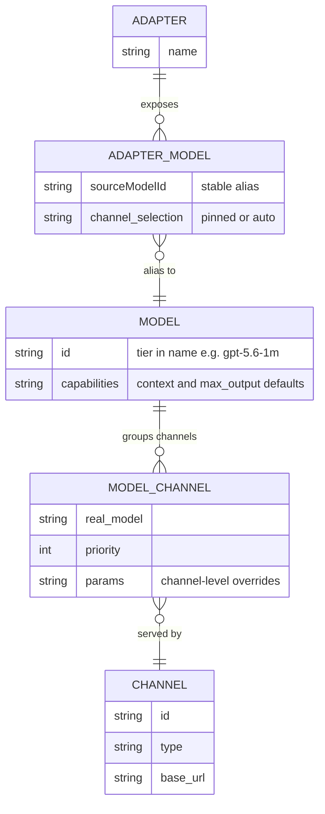
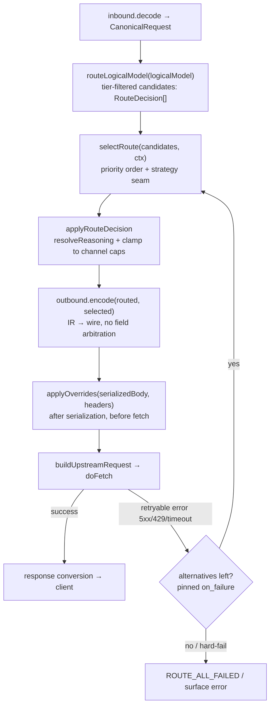

# AxonHub-Parity Orchestration Core - Plan

## Goal Capsule

- **Objective:** Build the orchestration core on llm-proxy's existing Provider+Adapter foundation: model-centric routing where a logical model (a "model group" bundling same-tier channels) is served by multiple channels with priority/failover/load-balancing; adapters expose stable per-app aliases that hide real model names; a declarative override engine configures backend behavior; reasoning resolution is centralized across the three protocols. Get the gateway to AxonHub-grade routing before adding custom logic.
- **Product authority:** This plan owns routing/model/channel orchestration + the override engine + reasoning centralization. Model management (`/v1/models`), cost accounting, observability, channel probing/circuit-breaking/rate-limiting, our custom reasoning templates/thinkingLevelMap, extra protocol providers, and the management UI are surrounding areas, not active scope.
- **Open blockers:** None. Key product decisions were settled in dialogue (see Key Decisions); the five planning questions are resolved in the Planning Contract's Key Technical Decisions.
- **Execution profile:** Subagent-driven under the commander model — exploration and implementation delegated, design and verification owned here. Parallel implementation subagents write in separate git worktrees; a single agent uses the main worktree.
- **Stop conditions:** Halt and surface (do not silently work around) if implementation finds the canonical IR cannot carry a multi-candidate route, if the override-after-serialization point breaks streaming, or if any settled Key Decision proves infeasible against the current code.
- **Tail ownership:** `ce-work` (or an equivalent executor) owns the commit/PR tail; this plan owns the decisions and the verification bar.

---

## Product Contract

### Summary

Add model-centric multi-channel routing to llm-proxy. A logical model groups the channels that serve it (each binding carries the channel-specific real model ID, priority, and capability tier); adapters expose stable per-app aliases so clients never see real model names or reconfigure when backends swap; a declarative override engine (borrowed from AxonHub) configures outbound request behavior; and reasoning resolution is centralized to remove the per-protocol drift inherited from P1. Multi-tenancy and auth stay out.

### Problem Frame

P1 translates three protocols end-to-end but routes one-to-one: an adapter alias maps to a single provider plus model. There is no failover, no load balancing, and no per-channel capability handling.

Real usage pulls the other direction. The same model is offered by many channels — kiro, cc, aggregators like OpenRouter — at different cost, speed, and context window. The operator wants to prioritize channels per model, fail over when one dies, and give each local application (pi, Claude, codex) its own adapter with fixed external model names. The client should never see the real model name and never need to reconfigure when the backend changes, because client-side model switching is awkward (config edits, reloads, some clients cannot easily change model).

AxonHub already solves the orchestration half — model-to-channels routing with priority, load balancing, failover, and a declarative override engine — but as a single-endpoint, multi-tenant gateway that exposes real model names to clients. We want its orchestration inside our per-app Adapter facade, not its single-endpoint model.

P1's reasoning handling also needs repair. The field-level reasoning merge is scattered across the three outbound adapters and drifts: Anthropic uses a budget-priority chain with an anti-semantic `Math.max` clamp, the two OpenAI protocols ignore budget/type/enabled entirely, and five-level effort values are not downgraded for protocols that reject them. This belongs in one resolver.

### Key Decisions

- KD1. Keep the Provider+Adapter dual-layer facade; do not adopt AxonHub's single-endpoint model. (session-settled: user-directed — chosen over AxonHub single-endpoint: per-app stable aliases that hide real model names fit personal multi-app use.) Governs R6, R7, R8, R9.
- KD2. Route by logical model: the model is the routing unit and a "model group" bundling its channels; channels are supply. (session-settled: user-directed — chosen over adapter-picks-provider-then-model: model-centric routing enables multi-channel failover and matches AxonHub's proven core.) Governs R1, R2, R3.
- KD3. A capability tier (e.g. context window) is part of the logical model's identity, not an alias-level filter; `gpt-5.6-1m` and `gpt-5.6-fast` are two distinct models, each grouping same-tier channels. (session-settled: user-directed — chosen over alias-carries-context-filter: encoding tier in the model name is simpler and needs no runtime capability filtering.) Governs R4, R5.
- KD4. Real upstream model IDs and the serving channel are hidden behind adapter aliases; any model-listing surface exposes aliases only. (session-settled: user-directed.) Governs R7.
- KD5. Borrow AxonHub's declarative override engine — set/set_if_absent/delete plus header operations, lightweight text-template conditions, whitelisted template variables — applied after outbound serialization and before fetch. (session-settled: user-approved — AxonHub parity first, our own logic later.) Governs R11, R12.
- KD6. Centralize reasoning resolution in one resolver, replacing the scattered per-outbound merge. Governs R13, R14, R15.
- KD7. Exclude multi-tenancy, auth/login, and the management UI. (session-settled: user-directed.) Governs Scope Boundaries.
- KD8. Defer our custom reasoning templates and thinkingLevelMap consumer discovery; AxonHub-parity routing ships first. (session-settled: user-directed.) Governs Scope Boundaries.

### Requirements

**Entity model and routing**

- R1. The gateway routes by logical model: a request names a model through an adapter alias, and the gateway resolves that model's candidate channels and selects one.
- R2. A logical model groups the channels that serve it; each model-to-channel binding carries the channel-specific real model ID and a priority or weight.
- R3. Channel selection within a model honors priority order with failover on retryable failure, and supports optional load-balancing.
- R4. A capability tier is part of a logical model's identity; the channels grouped under a model share that tier (per KD3).
- R5. Routing never selects a channel whose capability falls below the model's declared tier (a 1M model routes only to channels offering at least 1M).

**Adapter facade**

- R6. An adapter exposes a set of stable external model names (aliases) bound to logical models; clients address the adapter by alias (per KD1).
- R7. The real upstream model ID and the serving channel are never exposed to the client; the alias is the only model identifier the client sees (per KD4).
- R8. An adapter alias binds either to a single channel (pinned) or to the model's full channel set (auto-routing); the channel-selection granularity is configurable per alias.
- R9. Swapping the channel or channels behind an alias requires no client change; the alias is a stable contract.

**Per-channel parameters and override engine**

- R10. A model-to-channel binding may carry channel-specific parameters (context window, max output) that override the model's defaults; the gateway clamps the request to the selected channel's limits.
- R11. A declarative override engine applies configured request modifications to the outbound request after serialization and before fetch, using AxonHub-style set/set_if_absent/delete body operations plus header operations (per KD5).
- R12. Override conditions use a lightweight template whose rendered result must equal `true`; protected fields (model, messages, stream, and similar) cannot be overridden.

**Reasoning centralization**

- R13. Reasoning resolution — client versus route versus model default, effort-to-budget mapping, and per-protocol projection — lives in one resolver that replaces the scattered per-outbound merge (per KD6).
- R14. The resolver respects a client explicit-off (type=disabled or enabled=false) and never re-enables reasoning the client disabled.
- R15. The three protocols' reasoning output is consistent: budget, type, effort, and summary are handled uniformly from the canonical ReasoningSpec, and the anti-semantic `Math.max` clamp is replaced with correct budget-less-than-max_tokens clamping.

**Configuration and compatibility**

- R16. Channels, models with their channel bindings, and adapters are configured declaratively in YAML with a PG mirror, consistent with the P1.16 double-write transition.
- R17. P1 behavior is preserved: the three-protocol translation and its behavioral-equivalence invariants do not regress, and the golden test suite stays green.



### Actors

- A1. Client application (pi, Claude, codex) — sends requests to an adapter alias and configures its context window from the alias's tier to drive compression.
- A2. llm-proxy gateway — resolves alias to model to channel, routes, overrides, and transforms.
- A3. Upstream channel (provider or aggregator) — serves the model under a channel-specific real ID with its own capabilities.
- A4. Operator — configures channels, models, and adapters.

### Key Flows

- F1. Routed request
  - **Trigger:** A1 sends a request to an adapter alias.
  - **Actors:** A1, A2, A3
  - **Steps:** Resolve alias to logical model; collect tier-eligible candidate channels; select by priority order (the strategy seam reserves load-balancing for later per KTD2); map to the channel's real model ID; apply the override engine and reasoning resolution; transform to the channel protocol; fetch; transform the response back; return to A1.
  - **Covers R1, R2, R3, R5, R11, R13**
- F2. Failover
  - **Trigger:** The selected channel returns a retryable error.
  - **Actors:** A2, A3
  - **Steps:** Try the next channel in priority order; repeat until success or channels exhaust. Failover retries only before the first byte is sent to the client; a mid-stream failure surfaces an error.
  - **Covers R3**
- F3. Capability-aware selection
  - **Trigger:** The request needs more context than some channels offer.
  - **Actors:** A2
  - **Steps:** Filter out channels below the required tier; route among the rest.
  - **Covers R5, R10**
- F4. Backend swap
  - **Trigger:** A4 rebinds an alias's channel binding.
  - **Actors:** A4, A2
  - **Steps:** Configuration changes; A1 keeps calling the same alias, unchanged.
  - **Covers R9**

### Acceptance Examples

- AE1. Tier-filtered routing
  - **Covers R5, R10.**
  - **Given** model `gpt-5.6-1m` (channels: gpt at 1M) and model `gpt-5.6-fast` (channels: kiro at 255k, cc at 255k).
  - **When** the client requests `gpt-5.6-1m` needing 500k of context.
  - **Then** the request routes to gpt (1M) and never to kiro or cc.
- AE2. Failover
  - **Covers R3.**
  - **Given** model `opus` with channels kiro (priority 1) and cc (priority 2).
  - **When** kiro returns a retryable error (500 or timeout).
  - **Then** the gateway retries on cc and the client receives a successful response without learning of the switch.
- AE3. Hidden backend swap
  - **Covers R7, R9.**
  - **Given** adapter `app-a` exposes alias `deep` bound to `opus`.
  - **When** the operator rebinds `deep` from kiro to cc.
  - **Then** the client still calls `deep`, unchanged, and never sees the real model ID or channel.
- AE4. Pinned versus auto selection
  - **Covers R8.**
  - **Given** alias `deep` pinned to kiro and alias `opus` auto over kiro and cc.
  - **When** `deep` is requested.
  - **Then** it always uses kiro; when `opus` is requested, it uses priority and failover across both.
- AE5. Reasoning resolution
  - **Covers R14, R15.**
  - **Given** the client sends thinking type disabled.
  - **Then** the resolver injects no reasoning on any protocol; given client max_tokens below budget, the budget is clamped to max_tokens minus one rather than enlarged.
- AE6. Override with protection
  - **Covers R11, R12.**
  - **Given** an override rule that sets reasoning_effort to high when the model matches.
  - **When** the condition is true.
  - **Then** the outbound request carries reasoning_effort high; a rule targeting the protected field `model` is rejected.

<!-- ce-section: work-relationships -->
### How This Work Fits Together

This plan owns the orchestration core — model-centric routing, the override engine, and reasoning centralization — built on P1's protocol translation. The surrounding breakdown is the current understanding, not a committed roadmap.

- Model management and `/v1/models` (exposing aliases and capabilities) — Depends on this plan's model and channel entities; enables capability discovery.
- Cost accounting (CostCalc, UsageLog) — Can proceed independently once routing produces request and usage data.
- Observability (trace, metrics, live capture endpoints) — Can proceed independently; enriches routing with measurement.
- Channel probing, circuit breaking, rate limiting, concurrency limiting — Depends on routing; extends channel selection with health and admission control.
- Custom reasoning templates and thinkingLevelMap — Our differentiation, deferred per KD8; builds on the centralized reasoning resolver.
- Management UI — Depends on the backend surface; last.

### Scope Boundaries

**Deferred for later**

- Model management and `/v1/models` exposing adapter aliases and capabilities.
- Cost accounting (CostCalc, UsageLog, per-channel pricing).
- Observability (trace, metrics, live capture endpoints).
- Channel health probing, circuit breaker, rate limiting, concurrency limiting.
- Custom reasoning templates and thinkingLevelMap consumer discovery (per KD8).
- Protocol providers beyond the three P1 supports (e.g. Gemini).
- Override operations beyond the v1 core (array append/prepend/insert/remove, rename, copy).
- Load-balancing strategies beyond priority-plus-failover (weight, round-robin, latency-based).
- Credential encryption / vault resolution (the P1.16 plaintext `credential_ref` TODO).

**Outside this product's identity** (per KD7)

- Multi-tenancy (projects, users, roles).
- Auth and login (API key auth, OIDC, JWT).
- Management UI and the GraphQL admin plane.

### Dependencies / Assumptions

- P1 is complete: three-protocol translation, canonical IR, YAML+PG configuration, the pipeline, and the golden test suite.
- AxonHub source and analysis are available for reference (`docs/research/axonhub-analysis.md` and the local AxonHub checkout).
- Assumption: personal single-user deployment, so no auth or tenancy is required.
- Assumption: channels are configured statically (YAML/PG); automatic upstream model fetching is deferred.

### Outstanding Questions

The five planning questions raised in the requirements phase are resolved in the Planning Contract's Key Technical Decisions: override operation breadth → KTD1, load-balancing strategies → KTD2, pinned-channel failure behavior → KTD3, per-channel parameter shape → KTD4, configuration migration shape → KTD5. No blocking questions remain. Deferred (non-blocking): whether the legacy `provider` + `targetModelId` adapter fields carry a deprecation timeline (kept valid indefinitely for now).

### Sources / Research

- AxonHub override engine: `internal/server/orchestrator/override.go` (nine body and four header operations, text-template conditions, whitelisted template variables, apply-after-serialization, fail-open), `internal/objects/channel.go` (operation data model), `internal/server/biz/channel_override.go` (validation).
- AxonHub reasoning: `llm/model.go` (ReasoningEffort/Budget/Summary canonical fields), per-protocol effort tables (`llm/transformer/anthropic/thinking.go`, `llm/transformer/gemini/convert.go`), `internal/server/orchestrator/auto_reasoning_effort.go` (model-name suffix parsing); confirmed absence of named reasoning templates and thinkingLevelMap discovery.
- AxonHub routing: Channel-centric model with model associations, the orchestrator middleware chain, load-balancer strategies, and retry/failover (`internal/server/orchestrator/`).
- AxonHub analysis: `docs/research/axonhub-analysis.md`.
- llm-proxy P1: `src/proxy/ir/` (canonical IR, ReasoningSpec), `src/proxy/adapters/` (three-protocol inbound/outbound with the scattered reasoning merge), `src/proxy/pipeline.ts` (applyRouteDecision), `src/proxy/router.ts`, `src/db/schema/` (PG hooks), `src/config/`.
- P2 code reconnaissance (current structure, signatures copied from source): `src/proxy/pipeline.ts` (`applyRouteDecision` passes reasoning through without merging; outbound serialization then `doFetch` is the override insertion seam), `src/proxy/router.ts` (`routeModel` / `resolveAdapterRoute` are strict one-to-one), `src/proxy/adapters/outbound/{anthropic,openai-chat,openai-responses}.ts` (the three-way reasoning drift; the Anthropic `Math.max(max, budget)` clamp), `src/db/schema/` (`providers.priority`, `providers.enabled`, and `adapter_model_mappings.generation_overrides` already exist in PG but are not consumed at runtime), `test/helpers/translate.ts` (the single helper seam that auto-covers golden tests).
- P1 design: `docs/plans/2026-07-27-003-feat-p1-protocol-core-design.md`.
- Master plan: `docs/plans/2026-07-27-002-master-axonhub-class-gateway-plan.md`.

---

## Planning Contract

Product Contract unchanged — all R/A/F/AE IDs and their meaning are preserved from the requirements-only artifact; this enrichment adds the Planning Contract, Implementation Units, Verification Contract, and Definition of Done.

**Implementation approach.** The work extends the existing pipeline and router rather than rewriting them. Routing grows from one-to-one to "candidate list plus select": the router resolves a logical model to a tier-filtered list of channel routes and a selector picks one with failover alternatives. Two new modules slot into the existing request flow — a reasoning resolver called inside `applyRouteDecision` (replacing the per-outbound field merge) and an override engine applied after outbound serialization and before fetch. Config grows an additive model-group section; existing one-to-one adapter mappings auto-promote to single-channel groups so current configs keep working (R17). Three PG columns that already exist but are unused at runtime (`providers.priority`, `providers.enabled`, `adapter_model_mappings.generation_overrides`) are consumed rather than re-created.

### Key Technical Decisions

- KTD1. The v1 override engine ships the core field-and-header operations — body `set` / `set_if_absent` / `delete` and header `set` / `delete` — on an extensible operation registry; array, rename, and copy operations are deferred. (session-settled: user-approved — chosen over AxonHub's full nine-body-plus-four-header set: the core covers backend parameter tweaking, and a registry makes later operations additive.) Instantiates KD5; governs R11, R12.
- KTD2. v1 channel selection is priority order plus failover on retryable error, behind a strategy seam that later load-balancing strategies (weight, round-robin, latency) plug into without rework. (session-settled: user-approved — chosen over building all strategies now: priority-plus-failover is the proven core and the seam keeps LB additive.) Governs R3.
- KTD3. A pinned channel that fails hard-fails by default; a per-alias `on_failure` setting (`hard_fail` default, `fallback` opt-in) controls whether it falls back to the model's other channels. (session-settled: user-approved — chosen over auto-fallback by default: a pin expresses intent for a specific channel, so silent fallback defeats it; surfacing the failure is the safer semantic.) Governs R8.
- KTD4. Per-channel parameters are typed capability caps (`context_window`, `max_output_tokens`) that routing and clamping read structurally, with the declarative override engine as the escape hatch for non-routing tweaks; capability caps are not stored as an open JSON blob. (session-settled: user-approved — chosen over a single open JSONB: capability filtering per R5 and clamping per R10 need structured reads.) Governs R5, R10.
- KTD5. Configuration migration is additive: a new `model_groups` section plus an adapter `model` reference, with legacy one-to-one adapter mappings auto-promoted to single-channel groups so existing configs keep working. (session-settled: user-approved — chosen over a breaking rewrite: R17 mandates P1 preservation.) Governs R16, R17.
- KTD6. The reasoning resolver is called inside `applyRouteDecision`, replacing the reasoning passthrough; the three outbound adapters reduce to IR-to-wire mapping with no field arbitration; `max_tokens` (from generation / route override) is decoupled from `budget_tokens` (from reasoning), removing the Anthropic `Math.max(max, budget)` clamp. Instantiates KD6; governs R13, R14, R15.
- KTD7. The routing API is `routeLogicalModel(store, logicalModel) → RouteDecision[]` (tier-filtered candidates) plus `selectRoute(decisions, ctx) → { selected, alternatives }`; `resolveAdapterRoute` resolves an alias to a model group then to candidates; `RouteDecision` gains `priority`, `alternatives`, and the channel capability caps; the adapter handler calls `selectRoute` and passes `alternatives` into the pipeline (`ForwardParams` gains `alternatives`). Governs R1, R2.
- KTD8. Overrides apply after `outbound.encode` (on the serialized body JSON) and before fetch — matching AxonHub's apply-after-serialization point; header operations apply to the upstream headers, body operations to the serialized body. The applicable override rules (adapter-alias and selected-channel scope) are resolved at route time and carried on the route context into `applyOverrides` and `resolveReasoning`. Instantiates KD5; governs R11.
- KTD9. The PG layer adds two new tables (`model_groups`, `model_group_channels`) plus one additive column (`adapter_model_mappings.model_group_id`, a nullable FK carrying the adapter-alias-to-model-group binding while the legacy `provider_model_id` is retained); it round-trips the existing `providers.priority` / `providers.enabled` columns for data preservation and consumes `adapter_model_mappings.generation_overrides` as the override engine's channel-scope entry. Model-group routing consumes `model_group_channels.priority` (new), not `providers.priority`. Governs R16.

### High-Level Technical Design

Request pipeline with the new routing, reasoning, and override stages and the failover loop:



Override rule grammar (directional guidance, not implementation specification):

```text
OverrideRule:
  scope: adapter-alias | channel          # 作用域
  when:  "<轻量模板>"                       # 渲染结果 == "true" 才应用
  body:                                    # 对序列化 body JSON 的操作
    - { op: set,           path: "reasoning_effort", value: "high" }
    - { op: set_if_absent, path: "temperature",      value: 0.7 }
    - { op: delete,        path: "metadata.debug" }
  headers:
    - { op: set,    name: "X-Channel", value: "kiro" }
    - { op: delete, name: "X-Internal" }

白名单模板变量: model, logicalModel, provider, providerProtocol, resolvedModel
保护字段（拒绝覆写）: model, messages, stream, system, tools
操作注册表可扩展（v1: set / set_if_absent / delete + header set / delete）
失败开放: 模板渲染或应用出错 → 记录日志并透传，不阻断请求
```

### Sequencing

- Phase A (foundation): U1.
- Phase B (parallel after U1): U2 (PG), U3 (router), U5 (override engine).
- Phase C (after U3): U4 (reasoning resolver).
- Phase D (after U3, U4, U5): U6 (clamping + failover).
- Phase E (after all): U7 (integration + golden).

### System-Wide Impact

- Routing: the direct `routeModel` path (non-adapter calls) is preserved alongside the new multi-channel adapter path; the two coexist rather than one replacing the other.
- Reasoning: all three protocols now flow through one resolver; the outbound adapters lose their field-level arbitration, so reasoning behavior is defined in exactly one place.
- Config and PG: the change is additive — a new `model_groups` section and two new tables; legacy configs auto-promote to single-channel groups, so there is no breaking config change.
- Usage data: failover preserves the existing usage-recording behavior (one record for the request outcome); per-attempt accounting is deferred to the cost-accounting work.
- Streaming: unchanged — the IR stream events are untouched; reasoning and overrides are request-side only and never touch the response stream.
- Capture: the capture buffer reflects the post-override request (what is actually sent upstream), which is the correct debugging view.

### Risks & Dependencies

- PG clear-then-insert: `importConfigToPg` clears old rows before inserting; if `usage_records` reference old provider/model IDs the clear can fail on the foreign key (a known P1 limitation). Mitigation: keep the new tables additive and do not reorder the existing clear sequence; cover with the round-trip test.
- Overlapping pipeline edits: U4 (reasoning) and U6 (failover) both touch `applyRouteDecision` / `forwardPipeline`. Mitigation: sequence U4 before U6 so the failover loop wraps an already-resolved path.
- Golden behavior change: removing the `Math.max` clamp changes asserted behavior in the thinking-injection golden cases. Mitigation: the update is deliberate (U4 execution note) and the full golden gate (R17) guards everything else.
- Override timing: applying overrides on serialized JSON must stay pre-fetch and request-only. Mitigation: the engine never touches the response stream; the Goal Capsule stop condition halts if this breaks streaming.
- Routing return shape: `routeLogicalModel` returns a candidate list while the existing adapter handler expects a single route; U3 and U6 change `ForwardParams` / `forwardPipeline` to carry `alternatives`.
- Dependency: the PG integration tests (U2) require the Docker `postgres` instance.

---

## Implementation Units

### U1. Config types and validator for model groups

- **Goal:** Extend the config model for model-centric routing and override rules while keeping legacy one-to-one configs valid.
- **Requirements:** R2, R4, R8, R11, R16
- **Dependencies:** none
- **Files:** `src/config/types.ts`, `src/config/validator.ts`, `src/config/parser.ts`, `test/unit/config/parser.test.ts`, `test/unit/config/validator.test.ts`
- **Approach:**
  1. Add `ModelGroup` (`id`, optional `context_window` / `max_output_tokens` defaults, `channels: ModelChannelRef[]`) and `ModelChannelRef` (`provider`, `model`, optional `priority` / `context_window` / `max_output_tokens`).
  2. Extend `AdapterModelMapping` with an optional `model` (logical-model reference), optional `channel` (pin), and optional `overrides: OverrideRule[]`; keep the legacy `provider` + `targetModelId` fields. Add an optional `on_failure` (`hard_fail` default, `fallback`) to `AdapterConfig` (per-alias).
  3. Add `priority` / `enabled` to `Provider` and `context_window` to `Model` (per KTD4, KTD9).
  4. Define the `OverrideRule` type (`scope`, optional `when`, `body` ops, `header` ops) per KTD1.
  5. Validator: model-group channel refs point at declared providers/models; an adapter mapping carries either a `model` reference or the legacy pair, not both; override rules do not target protected fields (per R12); `on_failure` is one of the two allowed values.
- **Patterns to follow:** existing `Provider` / `Model` / `AdapterConfig` shapes and the validator's error style.
- **Test scenarios:**
  - Parse a config with a `model_groups` section and channel bindings (happy path).
  - Parse a legacy config with only one-to-one adapter mappings; it still validates (compat).
  - Parse an adapter alias with a `model` reference and a pinned `channel`.
  - Parse an override rule with body and header operations and a `when` condition.
  - Validator rejects a channel binding referencing an unknown provider or model (error path).
  - Validator rejects an adapter mapping that carries both a `model` reference and the legacy pair (error path).
  - Validator rejects an override rule targeting a protected field such as `model` (error path, covers R12).
  - An adapter config with `on_failure: fallback` parses; an invalid value is rejected (error path).
- **Verification:** typecheck clean; config parser and validator unit tests green.

### U2. PG schema, migration, and pg-mapper round-trip

- **Goal:** Persist model groups and channel bindings and round-trip the full config through PG, consuming the existing unused columns.
- **Requirements:** R16
- **Dependencies:** U1
- **Files:** `src/db/schema/model-groups.ts` (new), `src/db/schema/index.ts`, `drizzle/0002_model_groups.sql` (new migration), `src/config/pg-mapper.ts`, `test/config-pg.test.ts`
- **Approach:**
  1. Add `model_groups` (id, unique name, `context_window`, `max_output_tokens`, enabled, metadata) and `model_group_channels` (id, group FK, provider-model FK, priority, `context_window`, `max_output_tokens`, enabled) tables, plus a nullable `model_group_id` FK column on `adapter_model_mappings` (per KTD9).
  2. Extend `configToRows` / `rowsToConfig` to round-trip model groups, channel bindings, the adapter `model` reference, `Provider.priority` / `enabled`, and `Model.context_window`.
  3. Round-trip the already-present `providers.priority` and `providers.enabled` columns for data preservation, and consume `adapter_model_mappings.generation_overrides` as the override engine's channel-scope entry (per KTD9).
  4. Auto-promote a legacy one-to-one adapter mapping by synthesizing a single-channel model group and pointing the mapping's `model_group_id` at it (per KTD5).
  5. Generate the Drizzle migration for the two new tables and the new column.
- **Patterns to follow:** the existing `providers` / `adapters` schema definitions and the bidirectional pure-function mapper.
- **Test scenarios:**
  - `configToRows` then `rowsToConfig` preserves model groups, channel bindings, and priorities (round-trip).
  - A legacy config with no model groups round-trips unchanged, with each legacy mapping auto-promoted to a single-channel group (compat).
  - The adapter `model_group_id` binding survives the round-trip.
  - `Provider.priority` and `enabled` survive the round-trip (data preservation).
  - The migration applies cleanly against the Docker PG instance (integration).
- **Verification:** config-pg round-trip tests green; migration applies without error.

### U3. Model-centric router: candidates, selection, capability filter

- **Goal:** Replace one-to-one routing with candidate-list-plus-select, including tier filtering and pinned-versus-auto resolution.
- **Requirements:** R1, R2, R3, R5, R8
- **Dependencies:** U1
- **Files:** `src/proxy/router.ts`, `src/proxy/adapters/index.ts`, `src/proxy/routes.ts`, `test/unit/proxy/router.test.ts`
- **Approach:**
  1. Add `routeLogicalModel(store, logicalModel) → RouteDecision[]`: resolve the model group, build a `RouteDecision` per channel (real model ID, priority, caps), and drop channels below the group's tier (per R5, KTD7).
  2. Add `selectRoute(decisions, ctx, strategy='priority') → { selected, alternatives }` with the strategy seam (per KTD2).
  3. Rework `resolveAdapterRoute` to resolve an alias to a `model` reference then to candidates; a pinned `channel` yields a single decision, an auto alias yields the full list (per R8).
  4. Extend `RouteDecision` with `priority`, `alternatives`, and the channel capability caps; add `ROUTE_GROUP_NOT_FOUND`, `ROUTE_NO_ELIGIBLE_CHANNEL` (the tier filter emptied the candidate list), and `ROUTE_ALL_FAILED` error codes. The adapter handler calls `selectRoute` and passes `alternatives` into `forwardPipeline` (`ForwardParams` gains `alternatives`).
- **Patterns to follow:** the existing `routeModel` / `resolveAdapterRoute` / `buildRouteDecision` structure.
- **Test scenarios:**
  - Covers AE1: a 1M model with a 1M channel and 255k channels routes only to the 1M channel.
  - A multi-channel model returns candidates in priority order (happy path).
  - Covers AE4 (pinned): a pinned alias returns exactly its pinned channel.
  - Covers AE4 (auto): an auto alias returns the full candidate list.
  - Unknown logical model raises `ROUTE_GROUP_NOT_FOUND` (error path).
  - Capability filtering excludes every sub-tier channel (edge case).
  - A model whose channels are all below its tier yields `ROUTE_NO_ELIGIBLE_CHANNEL` (error path).
- **Verification:** router unit tests green; typecheck clean.

### U4. Reasoning resolver and outbound centralization

- **Goal:** Centralize reasoning resolution into one resolver, fix the anti-semantic clamp, and reduce the outbound adapters to IR-to-wire mapping.
- **Requirements:** R13, R14, R15
- **Dependencies:** U3
- **Files:** `src/proxy/reasoning-resolver.ts` (new), `src/proxy/pipeline.ts`, `src/proxy/adapters/outbound/anthropic.ts`, `src/proxy/adapters/outbound/openai-chat.ts`, `src/proxy/adapters/outbound/openai-responses.ts`, `test/unit/reasoning-resolver.test.ts` (new), `test/golden/thinking-injection.test.ts`
- **Approach:**
  1. Add `resolveReasoning(client, route, overrides?) → ReasoningSpec`: per-field arbitration (route over client), a single shared effort-to-budget table, explicit-off respect (per R14), `source` labeling (`client` / `route` / `override`), and `clientEffort` preservation (per KTD6).
  2. Call the resolver inside `applyRouteDecision`, replacing the reasoning passthrough.
  3. Decouple `max_tokens` (generation / route override) from `budget_tokens` (reasoning); remove the Anthropic `Math.max(max, budget)` clamp (per KTD6, R15).
  4. Slim the three outbound adapters to read the resolved `ReasoningSpec` and project it to the wire form per protocol capability (Anthropic uses budget/type; Chat uses effort; Responses uses effort/summary; Chat/Responses ignore budget).
- **Patterns to follow:** the existing `effortBudget` table (deduplicated into the resolver) and the IR `ReasoningSpec`.
- **Test scenarios:**
  - Covers AE5: client thinking type disabled injects no reasoning on any protocol.
  - Covers AE5: client max_tokens below budget clamps budget to max_tokens minus one and does not enlarge max_tokens.
  - Route effort wins over client effort in arbitration (happy path).
  - Effort maps to budget through the shared table (happy path).
  - `clientEffort` is preserved on the resolved spec (edge case).
  - `source` is `override` when an override rule set reasoning (integration with U5).
  - Anthropic emits `thinking.budget_tokens`; Chat emits `reasoning_effort`; Responses emits `reasoning.effort`/`summary` (per-protocol projection).
- **Verification:** reasoning-resolver unit tests green; the thinking-injection golden cases are updated for the decoupled clamp and green; outbound unit tests green.
- **Execution note:** The thinking-injection golden assertions change deliberately — the `Math.max` clamp removal is intended behavior, not a regression.

### U5. Override engine and pipeline wiring

- **Goal:** Implement the declarative override engine (core operations, condition, protected fields, whitelist) and apply it after serialization, before fetch.
- **Requirements:** R11, R12
- **Dependencies:** U1
- **Files:** `src/proxy/override-engine.ts` (new), `src/proxy/pipeline.ts`, `test/unit/override-engine.test.ts` (new)
- **Approach:**
  1. Add `applyOverrides(body, headers, ctx) → { body, headers }` with an extensible operation registry holding the v1 operations (per KTD1).
  2. Implement the condition renderer: a lightweight template whose rendered result must equal `true`, with whitelisted variables only (per R12).
  3. Enforce the protected-field guard at config validation and at runtime (per R12).
  4. Wire application into the pipeline between `buildUpstreamRequest` and the existing `capture.updateRequest('requestOut')` call so the captured request reflects the post-override body; header ops apply to upstream headers, body ops to the serialized body (per KTD8). `applyOverrides` reads the applicable overrides carried on the route context (resolved at route time from adapter-alias and channel scope).
  5. Fail open on render or apply error: log and pass through (matching AxonHub).
- **Patterns to follow:** AxonHub `internal/server/orchestrator/override.go` (apply-after-serialization, text-template condition, whitelist, fail-open).
- **Test scenarios:**
  - Covers AE6: a rule setting `reasoning_effort` applies when its condition renders true.
  - Covers AE6: a rule targeting the protected field `model` is rejected.
  - `set_if_absent` writes only when the path is missing (edge case).
  - `delete` removes a body path; header `set` / `delete` mutate headers (happy path).
  - A false condition is a no-op (edge case).
  - An unknown template variable fails open without crashing (error path).
  - Registering a new operation extends the registry (extensibility).
- **Verification:** override-engine unit tests green; the pipeline applies overrides end-to-end via the translate helper.

### U6. Per-channel clamping, failover loop, per-attempt usage

- **Goal:** Clamp requests to the selected channel's caps and fail over on retryable errors, preserving the existing usage-recording behavior.
- **Requirements:** R3, R10
- **Dependencies:** U3, U4, U5
- **Files:** `src/proxy/pipeline.ts`, `src/proxy/router.ts`, `test/pipeline.test.ts`
- **Approach:**
  1. Clamp `generation.maxTokens` / output to the selected channel's caps inside `applyRouteDecision` (per R10, KTD4).
  2. Add a retryable-error classifier (5xx, 429, timeout) in the router.
  3. Wrap the encode/override/fetch path in a failover loop that retries only before the first byte is sent to the client: on a retryable error, `selectRoute` the next alternative and re-run, trying each candidate once until the finite list exhausts; a mid-stream failure surfaces an error; a pinned alias honors `on_failure` (hard-fail surfaces the error, fallback tries the model's other channels) (per KTD3).
  4. Preserve the existing usage-recording behavior (one record for the request outcome); failover must not change usage cardinality.
- **Patterns to follow:** the existing `forwardPipeline` `doFetch` and `recordUsage` flow.
- **Test scenarios:**
  - Covers AE2: the priority-1 channel returns 503, the gateway retries the priority-2 channel, and the client gets a success without seeing the switch.
  - Covers F3 (clamping): a request whose max_tokens exceeds the channel cap is clamped down.
  - Pinned hard-fail: a pinned channel returning 503 surfaces an error with no fallback (default).
  - Pinned fallback: a pinned channel returning 503 falls back to the model's other channel when `on_failure=fallback`.
  - A non-retryable 400 does not retry (error path).
  - All channels failing raises `ROUTE_ALL_FAILED` (error path).
  - A mid-stream failure (after the first byte) surfaces an error rather than retrying (error path).
  - Usage is recorded once for the request outcome, unchanged by failover (compat).
- **Verification:** pipeline failover tests green with a mocked `fetchImpl`.
- **Execution note:** Mock `fetchImpl` to simulate 503 / 429 / timeout per channel.

### U7. Integration, golden coverage, and helpers

- **Goal:** Cover model-group routing end-to-end, extend the test helpers, and confirm the golden suite does not regress.
- **Requirements:** R17
- **Dependencies:** U1, U2, U3, U4, U5, U6
- **Files:** `test/helpers/route.ts`, `test/helpers/translate.ts`, `test/golden/model-group-routing.test.ts` (new), `test/pipeline.test.ts`
- **Approach:**
  1. Add `makeRouteGroup(options) → RouteDecision[]` to the route helper for multi-channel tests.
  2. Insert `applyOverrides` into the `translate` helper after `outbound.encode` (operating on the encoded wire body) so golden tests exercise the override path; `resolveReasoning` runs automatically inside `applyRouteDecision` and needs no helper insertion.
  3. Add an end-to-end model-group routing golden test (alias → model group → channel → mocked upstream → response).
  4. Run the full golden suite (translation-equivalence, translation-response, stream-equivalence, ccx-compat) to confirm no regression.
- **Patterns to follow:** the existing `makeRoute` and `translate` helpers.
- **Test scenarios:**
  - Covers AE3: rebinding an alias's channel leaves the client calling the same alias, with the real model and channel hidden.
  - Covers F1: a full routed request flows alias → model → channel → upstream and back.
  - Cross-protocol routing through a model group translates correctly (integration).
  - The pre-existing golden suite stays green (R17).
- **Verification:** all tests green (unit, golden, Docker integration); typecheck clean.

---

## Verification Contract

Repo-specific gates (per `CLAUDE.md`):

- **Typecheck:** `tsc --noEmit` reports zero errors.
- **Unit + golden tests:** `node --import tsx --test test/**/*.test.ts` is green, including the new `test/unit/reasoning-resolver.test.ts`, `test/unit/override-engine.test.ts`, `test/golden/model-group-routing.test.ts`, and the updated `test/golden/thinking-injection.test.ts`.
- **Docker integration:** the PG-backed tests (`test/config-pg.test.ts`, `test/db.test.ts`) pass against the Docker `postgres` instance (`shared-net`, `llmproxy_dev`), including the new `model_groups` migration.
- **Build:** `npm run build` succeeds.
- **Lint/format:** Biome is clean.
- **Behavioral gate (R17):** the pre-existing golden suite (translation-equivalence, translation-response, stream-equivalence, ccx-compat) shows no regression against the P1 baseline; the only intended golden change is the thinking-injection clamp behavior (U4).

---

## Definition of Done

**Global**

- Typecheck reports zero errors and `npm run build` succeeds.
- The full test suite is green: unit, golden, and Docker integration.
- The golden suite shows no regression against the P1 baseline except the intended thinking-injection clamp change (R17).
- Biome is clean.
- `CLAUDE.md` is updated to reflect the model-centric routing model, the override engine, and the centralized reasoning resolver.
- No abandoned-attempt or experimental code remains in the diff; dead ends from approaches that did not pan out are removed.

**Per unit**

- U1: model-group config parses and validates; legacy configs still validate.
- U2: model groups round-trip through PG; the migration applies.
- U3: routing returns tier-filtered, priority-ordered candidates; pinned and auto resolve correctly.
- U4: one resolver owns reasoning; the `Math.max` clamp is gone; outbound adapters do no field arbitration.
- U5: overrides apply after serialization with protected-field rejection and fail-open.
- U6: failover retries retryable errors (pre-stream-start only); clamping enforces channel caps; the existing usage behavior is preserved.
- U7: model-group routing works end-to-end and the golden suite is green.
